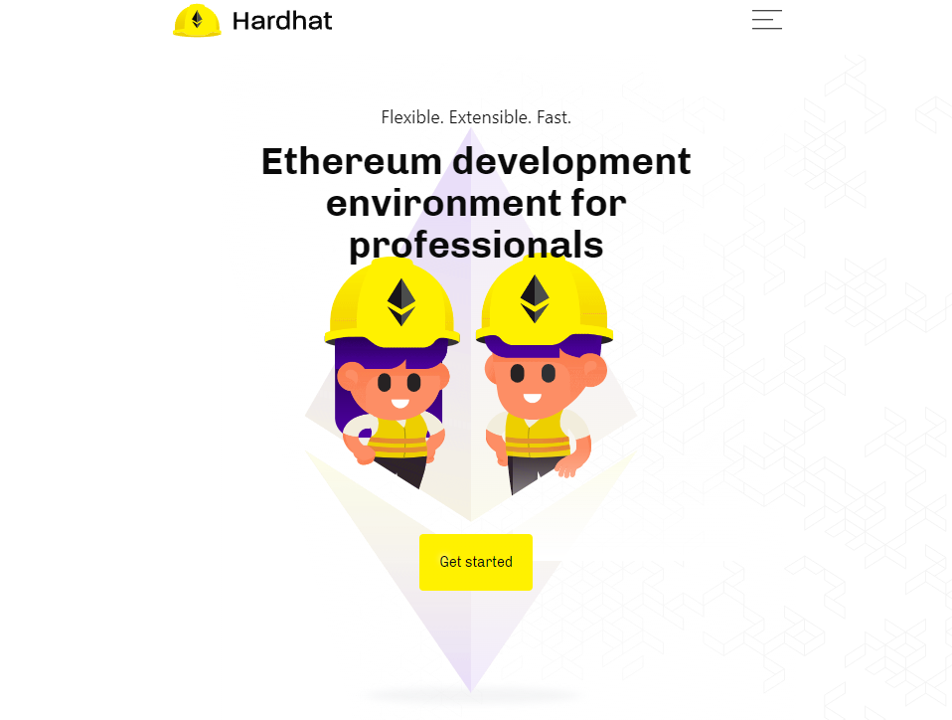
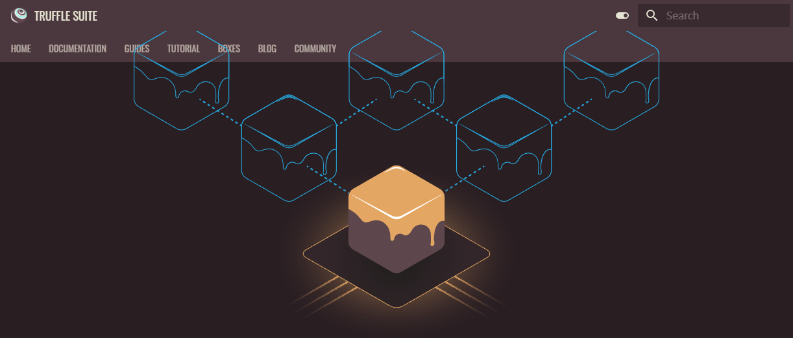
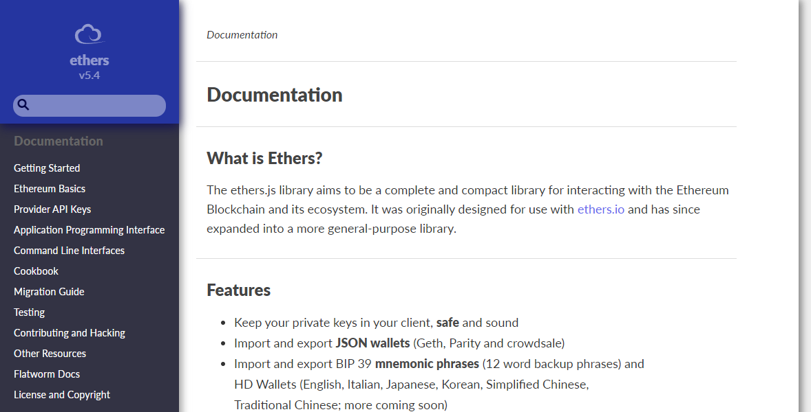

# 使用 Hardhat、Ganache 及 Ethers.js 建立一簡易的 DEX 去中心化交易所智能合約
  Build a Simple Decentralized Exchange (DEX) Smart Contracts Using Hardhat, Ganache and Ethers.js

## 緣由

- 我們在進行 Ethereum 乙太坊智能合約開發時，因為部署到以太坊的主網相當花錢，且部署到以太坊測試網也會遇到效能問題（仍要等到區塊被挖出時才部署完成）或是隱私權問題（不想被別人看到自己的智能合約）。

- 本文章即教大家如何在 Windows 作業系統上安裝 Hardhat、Ganache，並用 Ethers.js 及 Metamask 錢包與 Ganache 連接，並且和部署在 Ganache 上的 DEX 去中心化交易所智能合約互動，那麼我們就開始吧！

## 什麼是 Hardhat、Ganache 及 Ethers.js？

<details>
  <summary>請展開以查看內文：What are Hardhat, Ganache and Ethers.js?</summary>

### Hardhat

- Hardhat 可輕鬆部署合約、執行測試和調校 Solidity 程式碼（當執行失敗時，將可在主控臺追蹤 Solidity log 和錯誤資訊），而無需煩惱即時的區塊鏈環境，Hardhat 內建為開發而設計的本地端 Ethereum 網路。



### Ganache

- Truffle 團隊為了改善智能合約在 Ethereum 乙太坊主網開發成本過高、效能不佳等情況，為以太坊社群的開發者釋出一套免費的單機版以太坊節點 Ganache。讓開發人員可透過 Ganache 進行安全且快速的以太坊智能合約開發。



### Ethers.js 與 Web3.js

- Ethers.js 與 Web3.js 均是開發人員與 Ethereum 區塊鏈互動的 JavaScript Library 模組。Web3.js 自 2015 年起擁有大量的使用者社群，且有 Ethereum Foundation 相關的維護人員。

- 但 Web3.js 較為人詬病的問題是 API 不太友善、語法較為繁鎖，所以有了 Ether.js 模組的產生。Ethers.js 原先設計在 ethers.io 上，後來逐漸擴展至更全面性的套件。由於其語法精簡、支援 TypeScript 嚴謹開發語法及內建大量測試範本，深受乙太坊智能合約開發人員喜愛，而在近年來也有越來越多的專案在使用。

- 常見 Ethers.js 術語：
  - Provider：用來連接一個 Ethereum 乙太坊網路，且可讀取區塊鏈資訊及狀態。
  - Signer：用來直接或間接存取錢包私鑰，且可讀取簽章及交易資訊，並授權給不同區塊鏈網路。
  - Contract：用來連接已部署在乙太坊網路上指定的智能合約，且可與智能合約進行互動。


</details>

## 在 Windows 作業系統裡建置 Hardhat 開發環境與 Ganache 本地端區塊鏈網路
<details>
  <summary>請展開以查看內文：Build Hardhat development environment and Ganache local blockchain network in Windows OS</summary>

### 安裝適用於 Windows 作業系統的套件管理工具 [Chocolatey](https://chocolatey.org/) 

- 使用 [Chocolatey](https://chocolatey.org/) 來管理 Windows 軟體可以大大減少找尋 → 安裝軟體的時間

- 請在下方「開始」上點選滑鼠【右鍵】→【Windows 終端機（系統管理員）】→ 點選【是】允許此 APP 變更您的裝置


- 請在「Windows PowerShell」內輸入以下指令→ 按下鍵盤的【Enter】鍵（指令細節可參考官方「[Installing Chocolatey](https://chocolatey.org/install)」頁面）

  - 注意：指令不包含「>」前綴符號，請不要複製到

```PowerShell
> Set-ExecutionPolicy Bypass -Scope Process -Force; [System.Net.ServicePointManager]::SecurityProtocol = [System.Net.ServicePointManager]::SecurityProtocol -bor 3072; iex ((New-Object System.Net.WebClient).DownloadString('https://community.chocolatey.org/install.ps1'))
```

- 接著透過 Chocolatey 安裝 Chocolatey GUI、進階記事本 Notepad++、版控 Git、本地區塊鏈網路 Ganache、js 執行環境 Node.js、js 管理工具 Yarn、整合開發環境 Visual Studio Code、以及安裝 vscode 的 Solidity 語法視別

  - 注意：因為最新 Node.js 17 版使用最新的 OpenSSL 3.0 可能會和 hardhat 不相容，所以這裡安裝穩定 Node.js 16 版

  - 注意：使用 Chocolatey 安裝 Ganache 可能會失敗，此時請至「[Ganache Github](https://github.com/trufflesuite/ganache-ui/releases)」手動下載安裝（Ganache-*-win-setup.exe」

```PowerShell
> . "$ENV:ProgramData\chocolatey\bin\choco.exe" install -y git.install --params '/NoShellIntegration'
> . "$ENV:ProgramData\chocolatey\bin\choco.exe" install -y chocolateygui notepadplusplus.install ganache nodejs-lts yarn vscode
> . "$ENV:ProgramFiles\Microsoft VS Code\bin\code.cmd" --install-extension JuanBlanco.solidity
```


- 在瀏覽器中安裝 [Metamask](https://metamask.io/) 錢包
  - [Microsoft Edge](https://www.microsoft.com/zh-tw/edge) 版 Metamask 下載位置：[https://microsoftedge.microsoft.com/addons/detail/metamask/ejbalbakoplchlghecdalmeeeajnimhm](https://microsoftedge.microsoft.com/addons/detail/metamask/ejbalbakoplchlghecdalmeeeajnimhm)
  - [Google Chrome](https://www.google.com/intl/zh-TW/chrome/) 版 Metamask 下載位置：[https://chrome.google.com/webstore/detail/metamask/nkbihfbeogaeaoehlefnkodbefgpgknn](https://chrome.google.com/webstore/detail/metamask/nkbihfbeogaeaoehlefnkodbefgpgknn)
  - [Mozilla Firefox](https://www.mozilla.org/zh-TW/) 版 Metamask 下載位置：[https://addons.mozilla.org/zh-TW/firefox/addon/ether-metamask/](https://addons.mozilla.org/zh-TW/firefox/addon/ether-metamask/)


</details>

## 設置 Ganache 本地端區塊鏈網路相關參數
<details>
  <summary>請展開以查看內文：Set Ganache local blockchain network related parameters</summary>
</details>


