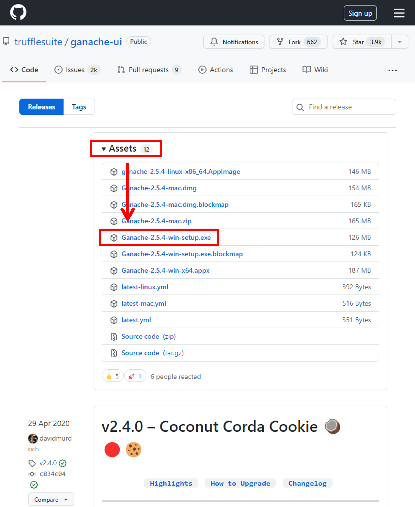
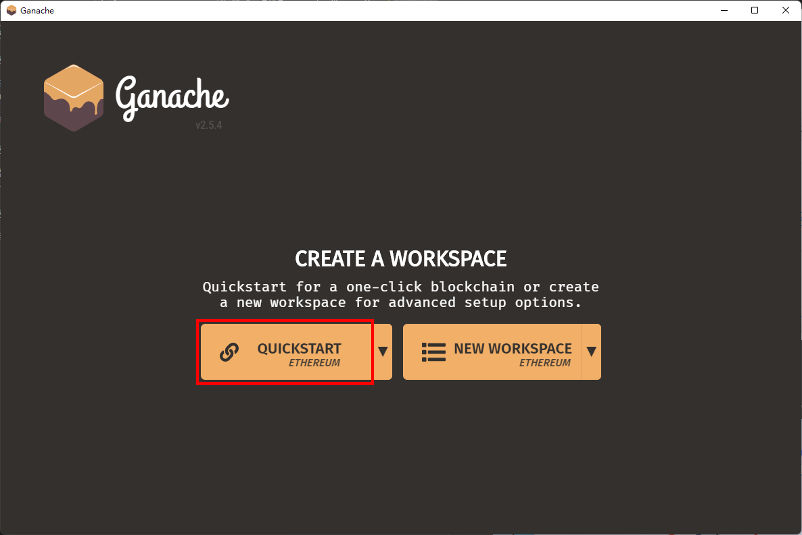
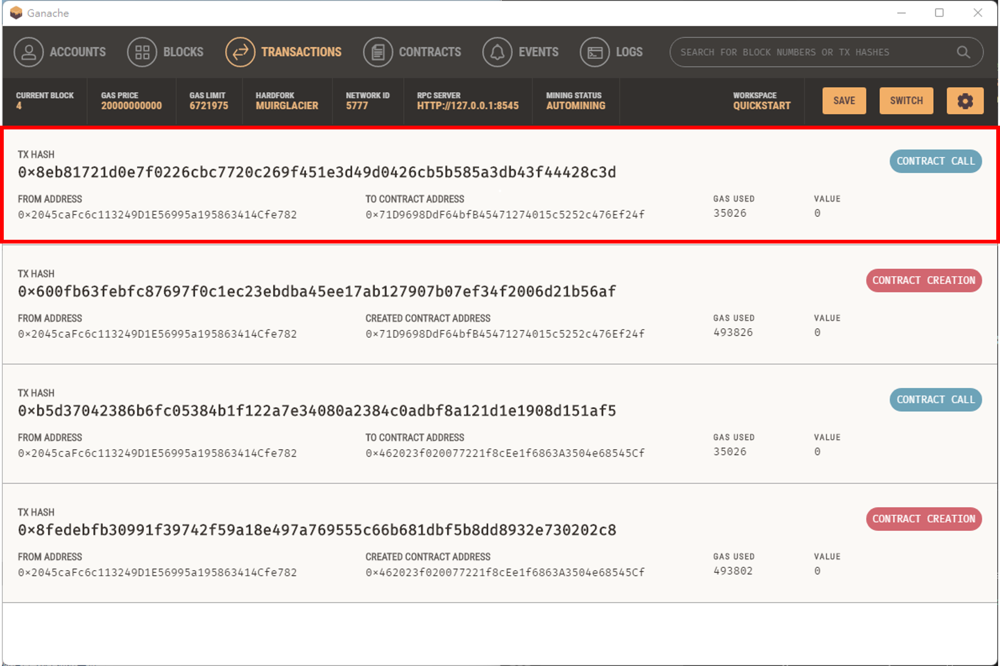
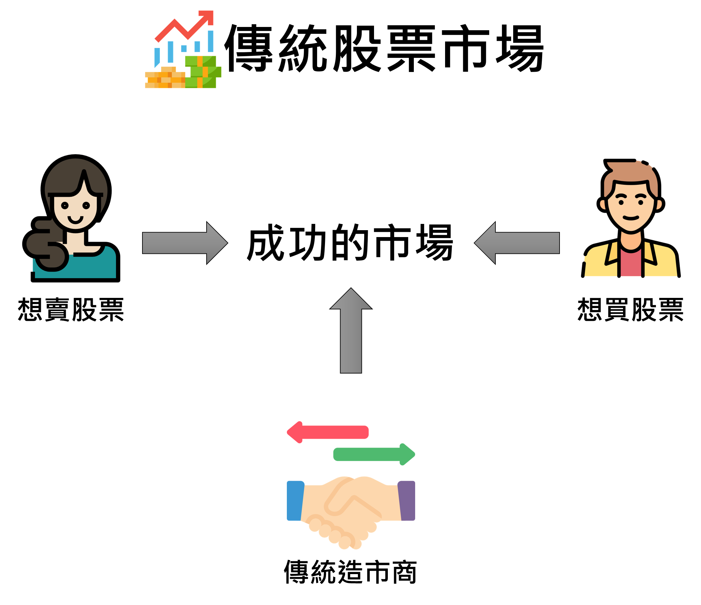

# 使用 Hardhat、Ganache 及 Ethers.js 建立一簡易的 DEX 去中心化交易所智能合約
  Build a Simple Decentralized Exchange (DEX) Smart Contracts Using Hardhat, Ganache and Ethers.js

<details>
  <summary>請展開此以查看本文目錄：Contents</summary>

  - [緣由](https://github.com/oneleo/awesome-blockchain-articles/tree/main/Build%20a%20Simple%20Decentralized%20Exchange%20(DEX)%20Smart%20Contracts%20Using%20Hardhat%2C%20Ganache%20and%20Ethers.js#%E7%B7%A3%E7%94%B1)

</details>

## 緣由
  The reason

- 我們在進行 Ethereum 乙太坊智能合約開發時，因為部署到以太坊的主網相當花錢，且部署到以太坊測試網也會遇到效能問題（仍要等到區塊被挖出時才部署完成）或是隱私權問題（不想被別人看到自己的智能合約）。

- 本文章即教大家如何在 Windows 作業系統上安裝 Hardhat、Ganache，並用 Ethers.js 及 Metamask 錢包與 Ganache 連接，並且和部署在 Ganache 上的 DEX 去中心化交易所智能合約互動，那麼我們就開始吧！

## 什麼是 Hardhat、Ganache 及 Ethers.js？
  What are Hardhat, Ganache and Ethers.js?

### Hardhat

- Hardhat 可輕鬆部署合約、執行測試和調校 Solidity 程式碼（當執行失敗時，將可在主控臺追蹤 Solidity log 和錯誤資訊），而無需煩惱即時的區塊鏈環境，Hardhat 內建為開發而設計的本地端 Ethereum 網路。


### Ganache

- Truffle 團隊為了改善智能合約在 Ethereum 乙太坊主網開發成本過高、效能不佳等情況，為以太坊社群的開發者釋出一套免費的單機版以太坊節點 Ganache。讓開發人員可透過 Ganache 進行安全且快速的以太坊智能合約開發。


### Ethers.js 與 Web3.js

- Ethers.js 與 Web3.js 均是開發人員與 Ethereum 區塊鏈互動的 JavaScript Library 模組。Web3.js 自 2015 年起擁有大量的使用者社群，且有 Ethereum Foundation 相關的維護人員。

- 但 Web3.js 較為人詬病的問題是 API 不太友善、語法較為繁鎖，所以有了 Ether.js 模組的產生。Ethers.js 原先設計在 ethers.io 上，後來逐漸擴展至更全面性的套件。由於其語法精簡、支援 TypeScript 嚴謹開發語法及內建大量測試範本，深受乙太坊智能合約開發人員喜愛，而在近年來也有越來越多的專案在使用。

- 常見 Ethers.js 術語：
  - Provider：用來連接一個 Ethereum 乙太坊網路，且可讀取區塊鏈資訊及狀態。
  - Signer：用來直接或間接存取錢包私鑰，且可讀取簽章及交易資訊，並授權給不同區塊鏈網路。
  - Contract：用來連接已部署在乙太坊網路上指定的智能合約，且可與智能合約進行互動。


## 在 Windows 作業系統裡建置 Hardhat 開發環境與 Ganache 本地端區塊鏈網路
  Build Hardhat development environment and Ganache local blockchain network in Windows OS

### 安裝適用於 Windows 作業系統的套件管理工具 [Chocolatey](https://chocolatey.org/) 

- 使用 [Chocolatey](https://chocolatey.org/) 來管理 Windows 軟體可以大大減少找尋 → 安裝軟體的時間

- 請在下方「開始」上點選滑鼠【右鍵】→【Windows 終端機（系統管理員）】→ 點選【是】允許此 APP 變更您的裝置


- 請在「Windows PowerShell」內輸入以下指令→ 按下鍵盤的【Enter】鍵（指令細節可參考官方「[Installing Chocolatey](https://chocolatey.org/install)」頁面）

  - 注意：指令不包含「>」前綴符號，請不要複製到

```PowerShell
> Set-ExecutionPolicy Bypass -Scope Process -Force; [System.Net.ServicePointManager]::SecurityProtocol = [System.Net.ServicePointManager]::SecurityProtocol -bor 3072; iex ((New-Object System.Net.WebClient).DownloadString('https://community.chocolatey.org/install.ps1'))
```

- 接著透過 Chocolatey 安裝 Chocolatey GUI、進階記事本 Notepad++、版控 Git、本地區塊鏈網路 Ganache、js 執行環境 Node.js、js 管理工具 Yarn、整合開發環境 Visual Studio Code、以及安裝 vscode 的 Solidity 語法視別

  - 注意：因為最新 Node.js 17 版使用最新的 OpenSSL 3.0 可能會和 hardhat 不相容，所以這裡安裝穩定 Node.js 16 版

  - 注意：使用 Chocolatey 安裝 Ganache 可能會失敗，此時請至「[Ganache Github](https://github.com/trufflesuite/ganache-ui/releases)」手動下載安裝（Ganache-*-win-setup.exe」

```PowerShell
> . "$ENV:ProgramData\chocolatey\bin\choco.exe" install -y git.install --params '/NoShellIntegration'
> . "$ENV:ProgramData\chocolatey\bin\choco.exe" install -y chocolateygui notepadplusplus.install ganache nodejs-lts yarn vscode
> . "$ENV:ProgramFiles\Microsoft VS Code\bin\code.cmd" --install-extension JuanBlanco.solidity
```


- 在瀏覽器中安裝 [Metamask](https://metamask.io/) 錢包
  - [Microsoft Edge](https://www.microsoft.com/zh-tw/edge) 版 Metamask 下載位置：[https://microsoftedge.microsoft.com/addons/detail/metamask/ejbalbakoplchlghecdalmeeeajnimhm](https://microsoftedge.microsoft.com/addons/detail/metamask/ejbalbakoplchlghecdalmeeeajnimhm)
  - [Google Chrome](https://www.google.com/intl/zh-TW/chrome/) 版 Metamask 下載位置：[https://chrome.google.com/webstore/detail/metamask/nkbihfbeogaeaoehlefnkodbefgpgknn](https://chrome.google.com/webstore/detail/metamask/nkbihfbeogaeaoehlefnkodbefgpgknn)
  - [Mozilla Firefox](https://www.mozilla.org/zh-TW/) 版 Metamask 下載位置：[https://addons.mozilla.org/zh-TW/firefox/addon/ether-metamask/](https://addons.mozilla.org/zh-TW/firefox/addon/ether-metamask/)


### 設置 Ganache 本地端區塊鏈網路相關參數
  Set Ganache local blockchain network related parameters

- 點選下方【開始】→ 點選【所有應用程式】→【Ganache】來執行 Ganache。


- 取消勾選【Analytics enabled. Thanks!】選項，以拒絕將相關資訊傳送回官網（可在設定中重新開啟）→ 點選【CONTINUE】以啟動 Ganache。


- 點選【QUICKSTART】一鍵式建置好本地端的 Ethereum 乙太坊網路



- 接下來我們要設置連入 Ganache 的連接埠，點選右上角【設定符號】


- 在「PORT NUMBER」中將原本的「7545」改成通用的【8545】埠 → 點選【RESTART】使設置生效。


### 使用 Metamask 連接至 Ganache
  Connect to Ganache using Metamask

- 在 Ganache 中，【複製】上方的 Mnemonic 助憶詞


- 來到 Microsoft Edge 瀏覽器，點選右上角的【Metamask 符號】→【開始使用】→【匯入錢包】→ 點選【No Thanks】捥拒收集匿名資訊


- 在「Secret Recovery Phrase」中輸入在 Ganache 複製的【Mnemonic 助憶詞】→ 輸入 2 次「Metamask 密碼」→ 勾選【I have read and agree to the 使用條款】→【匯入】→【都完成了】

  - 注意：實務上，助憶詞才是最重要、具有資產轉移的權限，這邊所輸入的密碼只是 Metamask 簽章前的臨時保護措施，關鍵還是助憶詞上的保管、勿輕易外洩！


- 因為預設連線至 Ethereum Mainnet 乙太坊主網，餘額顯示為 0，所以要改為連線至 Ganache 網路，請點選右上角【帳號】圖示 →【設定】→【進階】→【勾選】「Show test networks」以顯示本地端網路


- 點選右上角的【Metamask 符號】→ 點選上方【網路圖示】→【Localhost 8545】即可看到 Ganache 網路的 Balance 餘額


### 建置 Hardhat 開發環境，以及連接至 Ganache 本地端網路
  Set up the Hardhat development environment and connect to the Ganache local network

- 請再次點選下方「開始」上點選滑鼠【右鍵】→【Windows 終端機（系統管理員）】→ 並且輸入以下指令建立及使用 Visual Studio Code 開啟「hardhat_workspace」資料夾

```Powershell
> mkdir $ENV:USERPROFILE/hardhat_workspace/dex
> . "$ENV:ProgramFiles\Microsoft VS Code\bin\code.cmd" $env:USERPROFILE/hardhat_workspace/dex
```

- 點選【Yes，I trust the authors】信任此目錄


- 為方便開發，請點選【File】→【Preferences】→【Settings】→ 展開【Text Editor】→【Files】→ 在「Auto Save」點選【onFocusChange】以設置自動儲存，


- 點選上方【Terminal】→【New Terminal（Ctrl + Shift + `）】後即可輸入建置指令


- 請依序輸入下方指令 （指令細節可參考官方「[Creating a new Hardhat project](https://hardhat.org/tutorial/creating-a-new-hardhat-project.html)」頁面）

```PowerShell
# 初始化開發環境，會建立一 package.json 用以儲存所有「套件」相關資訊
> . "$ENV:ProgramFiles\nodejs\npm.cmd" init --yes
# 在「目前」資料夾安裝 hardhat 及下方「Create a basic sample project」會用到的相依套件
##「--save」：將套件資訊紀錄至 package.json 的 dependencies 中（生產環境所需套件列表）
##「--save-dev」：將套件資訊紀錄至 package.json 的 devDependencies 中（開發、測試環境所需套件列表）
> . "$ENV:ProgramFiles\nodejs\npm.cmd" install --save-dev hardhat @nomiclabs/hardhat-ethers ethers @nomiclabs/hardhat-waffle ethereum-waffle chai
# 安裝 openzeppelin 合約套件
> . "$ENV:ProgramFiles\nodejs\npm.cmd" install --save-dev @openzeppelin/contracts
# 未來需更新及修復 node 套件可執行以下指令
> . "$ENV:ProgramFiles\nodejs\npm.cmd" update
> . "$ENV:ProgramFiles\nodejs\npm.cmd" audit fix
```

- 建置一個簡單的 hardhat 智能合約開發環境

```PowerShell
> . "$ENV:ProgramFiles\nodejs\npx.cmd" hardhat
```

- 請依下列選項進行選擇

  - 「What do you want to do?」=【Create a basic sample project】
  - 「Hardhat project root:」=【C:\Users\bigred\hardhat_workspace\dex】
  - 「Do you want to add a .gitignore? (Y/n)」=【y】
  - 「Help us improve Hardhat with anonymous crash reports & basic usage data? (Y/n)」=【n】


- 請點選左側【hardhat.config.js】檔，並將 Ganache 上方的「RPC SERVER」位址複製到「module.exports = {}」內，如下圖所示


```Powershell
  networks: {
    myganache: {
      url: "HTTP://127.0.0.1:8545",
    },
  },
```


- 測試、及部署 ./contracts 資料夾內的合約（預設為 Greeter.sol 合約）至 Ganache 網路

  - 註：進行測試時可開啟 Ganache 或 Metamask 的「Transactions」頁面看到部署及測試交易情形

```Powershell
# 執行「./test」內的所有測試檔（確認「./contracts/Greeter.sol」智能合約儲存的字串是否為寫入的「Hello, world!」及「Hola, mundo!」）
> . "$ENV:ProgramFiles\nodejs\npx.cmd" hardhat test --network myganache
# 執行「./scripts」內的指定檔案（「./scripts/sample-script.js」將「./contracts/Greeter.sol」智能合約編譯後部署在 Ganache 本地區塊鏈網路，並印出合約地址
> . "$ENV:ProgramFiles\nodejs\npx.cmd" hardhat run --network myganache scripts/sample-script.js
```


## 使用 Ethers.js 與已部署至區塊鏈上的智能合約溝通
  Communicate with smart contracts deployed on the blockchain using Ethers.js

- 請將上一個步驟的合約地址複製起來，在這裡以【0x71D9698DdF64bfB45471274015c5252c476Ef24f】為例


- 請在 Visual Studio Code 左側「./scripts」上點選滑鼠【右鍵】→【New file】→ 取名為【set-greeter.js】


- 請在「./scripts/set-greeter.js」輸入以下程式碼

```JavaScript
async function main() {
// 取得 ./contracts/Greeter.sol 智能合約實例
const address = '<請在這邊貼入上個步驗複製的 ./contracts/Greeter.sol 智能合約地址>';
const contract = await ethers.getContractAt("Greeter", address);

// 執行 greet() 函數以取得儲存在合約內的字串
greeting = await contract.greet()

// 建置合約時預設儲存的是 "Hello, Hardhat!" 字串
console.log("greeting is:", greeting);

// 執行 setGreeting() 函數使用 "Hola, mundo!" 覆蓋舊的字串
await contract.setGreeting('Hola, mundo!')

// 再次執行 greet() 函數取得儲存在合約內的字串
greeting = await contract.greet()

// 此時合約內的字串為 "Hola, mundo!"
console.log("greeting is:", greeting);
}

main()
  .then(() => process.exit(0))
  .catch((error) => {
    console.error(error);
    process.exit(1);
  });
```

- 請輸入以下指令以執行「./scripts/set-greeter.js」和合約互動

```PowerShell
> . "$ENV:ProgramFiles\nodejs\npx.cmd" hardhat run --network myganache scripts/set-greeter.js
```




## 使用 Solidity 建置一個簡易 DEX 去中心化交易所智能合約及使用 Ethers.js 與此智能合約互動
  Build a simple DEX smart contract using Solidity and interact with this smart contract using Ethers.js

### 簡介什麼是去中心化交易所

- 想買股票就一定要有人賣股票，傳統股票間的流動性由傳統造市商產生，並收取合理的手續費



- 但在去中心化的情境，需要有人以手續費為誘因來提供流動性，這樣才可以進行搓合買賣。假設目前 ETH 幣價為每顆 100 USDT，投資客會將手上的 10 ETH 及等值之 1000 USDT 存入 DEX 交易所


- 若 ETH 幣價爆漲成每顆 400 USDT，則會有套利者使用比市場低的 USDT 換到 ETH，直到池內比例平衡為止；以這邊為例：此時池內總資產雖然為 5 * 400 + 2000 = 4000 USDT，但是當時若選擇不提供流動，則現在則應會有 10 * 400 + 1000 = 5000 USDT。4000 - 5000 = -1000 USDT 此稱為無常損失。


### 引用 OpenZeppelin 套件庫撰寫 MyTokenA 及 MyTokenB 合約

- 在「./contracts」內建立「MyTokenA.sol」檔，內容如下

```JavaScript
// SPDX-License-Identifier: MIT
pragma solidity ^0.8.4;

import "@openzeppelin/contracts/token/ERC20/ERC20.sol";

contract MyTokenA is ERC20 {
    constructor() ERC20("MyTokenA", "MTA") {
        _mint(msg.sender, 1000000 * 10 ** decimals());
    }
}
```

- 在「./contracts」內建立「MyTokenB.sol」檔，內容如下

```javaScript
// SPDX-License-Identifier: MIT
pragma solidity ^0.8.4;

import "@openzeppelin/contracts/token/ERC20/ERC20.sol";

contract MyTokenB is ERC20 {
    constructor() ERC20("MyTokenB", "MTB") {
        _mint(msg.sender, 1000000 * 10 ** decimals());
    }
}
```

### 建立簡易去中心化交易所 DEX 合約

- 在「./contracts」內建立「DEX.sol」檔，內容如下

```JavaScript
//SPDX-License-Identifier: Unlicense
pragma solidity ^0.8.4;

import "@openzeppelin/contracts/token/ERC20/IERC20.sol";
import "@openzeppelin/contracts/token/ERC20/ERC20.sol";
import "@openzeppelin/contracts/utils/math/SafeMath.sol";

contract DEX {
  using SafeMath for uint256;
  address public tokenA;
  address public tokenB;

  // 此為針對 MyTokenA 及 MyTokenB 建置的去中心化交易所
  constructor(address _tokenA, address _tokenB) {
    tokenA = _tokenA;
    tokenB = _tokenB;
  }

  // 確認雙幣合約無誤且有足夠幣量，則根據池內具有的流動性來進行幣幣交換 
  function swap(
    address from,
    address to,
    uint256 amount
  ) public {
    require((from == tokenA && to == tokenB) || (from == tokenB && to == tokenA), "Invalid tokens");
    require(IERC20(from).balanceOf(msg.sender) >= amount, "Not enough to swap");
    uint256 swap_amount = get_swap_price(from, to, amount);
    IERC20(from).transferFrom(msg.sender, address(this), amount);
    IERC20(to).approve(address(this), swap_amount);
    IERC20(to).transferFrom(address(this), msg.sender, swap_amount);
  }

  // 存入雙幣以提供去中心化交易所流動性 
  function add_liquidity(address token_address, uint256 amount) public {
    IERC20(token_address).transferFrom(msg.sender, address(this), amount);
  }

  // 根據池內具有的流動性來計算幣幣間可交換的數量
  function get_swap_price(
    address from,
    address to,
    uint256 amount
  ) public view returns (uint256) {
    return ((amount * IERC20(to).balanceOf(address(this))) / IERC20(from).balanceOf(address(this)));
  }

  // 授權此 DEX 合約可動用的幣資產
  function approve(address token, uint256 amount) public {
      SwappableToken(token).approve(address(this), amount);
  }

  // 回傳此人所擁有的指定 token 數量
  function balanceOf(address token, address account) public view returns (uint256) {
    return IERC20(token).balanceOf(account);
  }
}

// 引用 ERC20 合約以存取指定幣的相關函數
contract SwappableToken is ERC20 {
  constructor(
    string memory name,
    string memory symbol,
    uint256 initialSupply
  ) ERC20(name, symbol) {
    _mint(msg.sender, initialSupply);
  }
}
```

### 使用 Ethers.js 製作部署及操作 DEX.sol 合約

- 在「./scripts」內建立「deploy_dex.js」檔，內容如下

```JavaScript
const hre = require("hardhat");

async function main() {
  // 部署 MyTokenA 合約
  const TokenA = await hre.ethers.getContractFactory("MyTokenA");
  const tokenA = await TokenA.deploy();
  await tokenA.deployed();
  console.log("MyTokenA deployed to:", tokenA.address);

  // 部署 MyTokenB 合約
  const TokenB = await hre.ethers.getContractFactory("MyTokenB");
  const tokenB = await TokenB.deploy();
  await tokenB.deployed();
  console.log("MyTokenB deployed to:", tokenB.address);

  // 匯入 MyTokenA 及 MyTokenB 的合約地址來部署 DEX 合約
  const DEX = await hre.ethers.getContractFactory("DEX");
  const dex = await DEX.deploy(tokenA.address, tokenB.address);
  await dex.deployed();
  console.log("DEX deployed to:", dex.address);

  // 取得 Ganache 本地區塊鏈的帳戶資訊
  const accounts = await hre.ethers.getSigners();

  // 取得 MyTokenA、MyTokenB、DEX 合約的操作實例
  const myTokenAContract = await ethers.getContractAt("MyTokenA", tokenA.address);
  const myTokenBContract = await ethers.getContractAt("MyTokenB", tokenB.address);
  const dexContract = await ethers.getContractAt("DEX", dex.address);

  // 印出我目前所擁有的 MyTokenA 及 MyTokenB 數量
  myTokenABalance = await myTokenAContract.balanceOf(accounts[0].address);
  myTokenBBalance = await myTokenBContract.balanceOf(accounts[0].address);
  console.log("Before add liquidity, My TokenA Balance:", myTokenABalance.toString(), "My TokenB Balance:", myTokenBBalance.toString());

  // 授權 DEX 合約可以動用指定 MyTokenA、MyTokenB 數量
  wg = await myTokenAContract.approve(dex.address, 1000000000);
  await wg.wait();
  wg = await myTokenBContract.approve(dex.address, 5000000000);
  await wg.wait();

  // 將 MyTokenA、MyTokenB 存入 DEX 合約以增加流動性
  wg = await dexContract.add_liquidity(tokenA.address, 1000000000);
  await wg.wait();
  wg = await dexContract.add_liquidity(tokenB.address, 5000000000);
  await wg.wait();

  // 印出我目前所擁有的 MyTokenA 及 MyTokenB 數量（已扣除存入 DEX 以增加流動性的數量）
  myTokenABalance = await myTokenAContract.balanceOf(accounts[0].address);
  myTokenBBalance = await myTokenBContract.balanceOf(accounts[0].address);
  console.log("After add liquidity, My TokenA Balance:", myTokenABalance.toString(), "My TokenB Balance:", myTokenBBalance.toString());

  // 計算若使用 1000 顆 MyTokenA 可換多少 MyTokenB
  swap_price = await dexContract.get_swap_price(tokenA.address,tokenB.address,1000);
  console.log("If swap 1000 price from TokenA to TokenB:", swap_price.toString());

  // 授權 DEX 合約可以動用指定 MyTokenA 數量，以順利進行幣幣交換
  wg = await myTokenAContract.approve(dex.address, 1000);
  await wg.wait();
  // 以 1000 顆 MyTokenA 交換等值 MyTokenB
  wg = await dexContract.swap( tokenA.address, tokenB.address, 1000);
  await wg.wait();

  // 印出我目前所擁有的 MyTokenA 及 MyTokenB 數量（已增加使用 MyTokenA 交換的 MyTokenB 數量）
  myTokenABalance = await myTokenAContract.balanceOf(accounts[0].address);
  myTokenBBalance = await myTokenBContract.balanceOf(accounts[0].address);
  console.log("After swap, My TokenA Balance:", myTokenABalance.toString(), "My TokenB Balance:", myTokenBBalance.toString());
}

main()
  .then(() => process.exit(0))
  .catch((error) => {
    console.error(error);
    process.exit(1);
  });
```

- 執行「./scripts/deploy_dex.js」檔並印出結果

```PowerShell
> . "$ENV:ProgramFiles\nodejs\npx.cmd" hardhat run --network myganache scripts/deploy_dex.js
```


### 製作 DEX.sol 合約測試腳本

- 在「./test」內建立「dex-test.js」檔，內容如下

```JavaScript
const { expect } = require("chai");
const { ethers } = require("hardhat");

describe("DEX", function () {
  it("Should return the new dex once it's changed", async function () {
    // 部署 MyTokenA 合約
    const TokenA = await ethers.getContractFactory("MyTokenA");
    const tokenA = await TokenA.deploy();
    await tokenA.deployed();

    // 測試：MyTokenA 名稱及符號是否正確
    expect(await tokenA.name()).to.equal("MyTokenA");
    expect(await tokenA.symbol()).to.equal("MTA");

    // 部署 MyTokenB 合約
    const TokenB = await ethers.getContractFactory("MyTokenB");
    const tokenB = await TokenB.deploy();
    await tokenB.deployed();

    // 測試：MyTokenB 名稱及符號是否正確
    expect(await tokenB.name()).to.equal("MyTokenB");
    expect(await tokenB.symbol()).to.equal("MTB");

    // 匯入 MyTokenA 及 MyTokenB 的合約地址來部署 DEX 合約
    const DEX = await ethers.getContractFactory("DEX");
    const dex = await DEX.deploy(tokenA.address, tokenB.address);
    await dex.deployed();

    // 授權 DEX 合約可以動用指定 MyTokenA、MyTokenB 數量
    wg = await tokenA.approve(dex.address, 1000000000);
    await wg.wait();
    wg = await tokenB.approve(dex.address, 5000000000);
    await wg.wait();

    // 將 MyTokenA、MyTokenB 存入 DEX 合約以增加流動性
    wg = await dex.add_liquidity(tokenA.address, 1000000000);
    await wg.wait();
    wg = await dex.add_liquidity(tokenB.address, 5000000000);
    await wg.wait();

    // 取得 Ganache 本地區塊鏈的帳戶資訊
    const accounts = await ethers.getSigners();

    // 取得目前所擁有的 MyTokenA 及 MyTokenB 數量（已扣除存入 DEX 以增加流動性的數量）
    tokenABalance = await tokenA.balanceOf(accounts[0].address);
    tokenBBalance = await tokenB.balanceOf(accounts[0].address);

    // 測試：扣除存入 DEX 以增加流動性的 Token 數量是否正確
    expect(await tokenABalance.toString()).to.equal("999999999999999000000000");
    expect(await tokenBBalance.toString()).to.equal("999999999999995000000000");

    // 授權 DEX 合約可以動用指定 MyTokenA 數量，以順利進行幣幣交換
    wg = await tokenA.approve(dex.address, 1000);
    await wg.wait();
    // 以 1000 顆 MyTokenA 交換等值 MyTokenB
    wg = await dex.swap( tokenA.address, tokenB.address, 1000);
    await wg.wait();

    // 取得我目前所擁有的 MyTokenA 及 MyTokenB 數量（已增加使用 MyTokenA 交換的 MyTokenB 數量）
    tokenABalance = await tokenA.balanceOf(accounts[0].address);
    tokenBBalance = await tokenB.balanceOf(accounts[0].address);

    // 測試：已扣除及增加進行幣幣交換後的 Token 數量是否正確
    expect(await tokenABalance.toString()).to.equal("999999999999998999999000");
    expect(await tokenBBalance.toString()).to.equal("999999999999995000005000");
  });
});
```

- 執行「./test」內的所有測試檔並印出結果

```PowerShell
> . "$ENV:ProgramFiles\nodejs\npx.cmd" hardhat --network myganache test
```


## 總結
  Conclusion

- 使用 Ganache 本地端的區塊鏈網路可大大增加開發智能合約的效率，而不需等待 Ethereum Mainnet 或 Testnet 的挖礦時間及成本開銷
- 透過 Hardhat 框架可以快速的進行智能合約的部署與測試，甚至可以指定多個區塊鏈網路來進行多個合約的操作
- 使用 Ethers.js 可以較直覺的與不同智能合約來互動，而不需要像 Wwb3.js 一樣有繁瑣的帳號解鎖動作，以加快開發效能

## 本文架構

