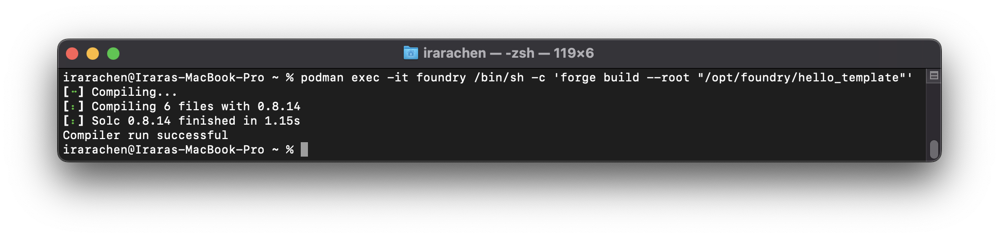
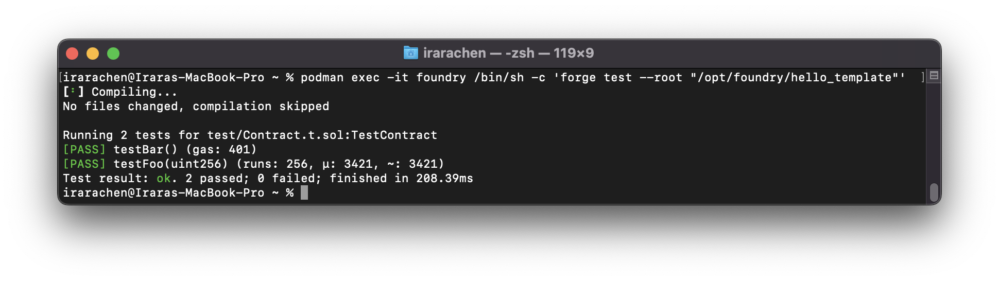
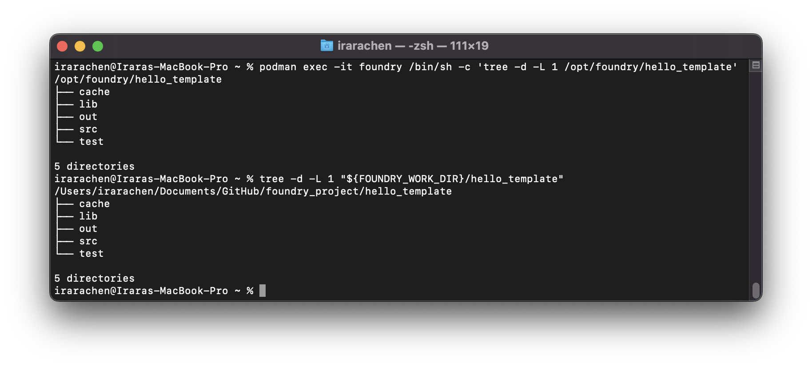

# 使用 Podman 容器技術建立 Foundry 乙太坊開發環境

## 參考資料

- Foundry 使用手冊

  - [https://book.getfoundry.sh/getting-started/installation.html](https://book.getfoundry.sh/getting-started/installation.html)

- Foundry Container 使用手冊

  - [https://book.getfoundry.sh/tutorials/foundry-docker.html](https://book.getfoundry.sh/tutorials/foundry-docker.html)

- Foundry Github

  - [https://github.com/foundry-rs/foundry](https://github.com/foundry-rs/foundry)

- Podman 手冊

  - [https://docs.podman.io/en/latest/Commands.html](https://docs.podman.io/en/latest/Commands.html)

- Favoring Podman over Docker Desktop
  - [https://medium.com/@butkovic/favoring-podman-over-docker-desktop-33368e031ba0](https://medium.com/@butkovic/favoring-podman-over-docker-desktop-33368e031ba0)

## 實作作業系統

- macOS

## 安裝及設置 Podman

- 安裝 Homebrew

```bash
~ % /bin/bash -c "$(curl -fsSL https://raw.githubusercontent.com/Homebrew/install/HEAD/install.sh)"
```

- 刪除 Docker

```bash
~ % brew uninstall --cask docker
~ % brew uninstall docker
```

- 安裝及更新 Podman

```bash
~ % brew install podman tree
~ % brew upgrade podman
~ % podman --version
```

- （僅 macOS 需做）在 macOS 作業系統中使用 Podman 前需先初始化 Podman 虛擬機

```bash
~ % podman machine init --volume $HOME:$HOME
~ % podman machine start
~ % podman machine list
~ % podman system connection list
```

## 建立 Foundry 容器及進行容器測試

- 下載 Foundry image

```bash
~ % podman image pull ghcr.io/foundry-rs/foundry:latest
~ % podman image history --no-trunc ghcr.io/foundry-rs/foundry:latest
~ % podman image list
```

- （可不做）將 Foundry Image 上傳到個人空間

```bash
~ % podman login docker.io --verbose
~ % podman push docker.io/oneleo/foundry:0.0.1
```

- （可不做）測試 Podman（-i=--interactive：保持標準輸入開啟，-t=--tty：保持對外終端開啟，--rm：容器工作結束後刪除，--replace：容器名稱重複不提示取代，--entrypoint：取代映像檔預定執行程式，-v=--volume：掛載目錄至容器）

```bash
~ % touch ~/tmp/test.file
~ % podman container run -it --rm --name foundry --replace --entrypoint "" -v ~/tmp:/tmp ghcr.io/foundry-rs/foundry:latest /bin/sh -c 'ls -al /tmp'
```

- （可不做）刪除不再使用的 Podman Volume

```bash
~ % podman volume list
~ % podman volume prune
```

## 設置相關臨時變數

- 建立 foundry 工作目錄，並設置成 FOUNDRY_WORK_DIR 臨時變數（關掉 Terminal 變數即清除）

```bash
~ % export FOUNDRY_WORK_DIR="$HOME/Documents/GitHub/foundry_project"

~ % mkdir -p "${FOUNDRY_WORK_DIR}"
```

- 請至 [https://www.alchemy.com/](https://www.alchemy.com/) 申請一組 Mainnet HTTPS API Key，並設置成 MAINNET_NODE_RPC_URL 臨時變數

```bash
~ % export MAINNET_NODE_RPC_URL="https://eth-mainnet.alchemyapi.io/v2/<YOUR ALCHEMY API KEY>"
```

- 請將您 GitHub 的 email 及 name 設置成臨時變數

```bash
~ % export GITHUB_EMAIL="<YOUR GITHUB EMAIL>"
~ % export GITHUB_NAME="<YOUR GITHUB NAME>"
```

## 開始建立 Foundry 容器

- 建立並啟動名為 foundry 的容器（-d=--detach：在背景執行，-e=--env：設置容器內環境變數）

```bash
~ % podman container run -itd --name foundry --replace \
--entrypoint "/bin/sh" \
-v "${FOUNDRY_WORK_DIR}":/opt/foundry \
-e RPC_URL="${MAINNET_NODE_RPC_URL}" \
ghcr.io/foundry-rs/foundry:latest

~ % podman container list --all

- （可不做）查看 foundry 容器狀態（「podman exec」=「podman container exec」）

~ % podman container exec -it foundry /bin/sh -c 'ls -al /opt/foundry_project'

~ % podman exec -it foundry /bin/sh -c 'printf "$(hostname -i)\n$(cat /etc/hosts)\n$(cat /etc/resolv.conf)\n$(netstat -peanutlx)"'
```

## 在 Foundry 容器內安裝必要依賴套件

- 在 foundry 容器內安裝 forge 所需依賴套件

```bash
~ % podman container exec -it foundry /bin/sh -c 'apk add git tree'

~ % podman container exec -it foundry /bin/sh -c "git config --global user.email ${GITHUB_EMAIL}"
~ % podman container exec -it foundry /bin/sh -c "git config --global user.name ${GITHUB_NAME}"

~ % podman container exec -it foundry /bin/sh -c "git config --list"
```

- 使用 foundry 容器查看乙太坊網路

```bash
~ % podman exec -it foundry /bin/sh -c 'cast block --rpc-url ${RPC_URL} --block latest'
```

- （可不做）查看 forge 指令

```bash
~ % podman exec -it foundry /bin/sh -c 'forge --help'
```

## 建立您的第一個 Foundry 專案

- 使用 foundry 容器建立空專案

```bash
~ % podman exec -it foundry /bin/sh -c 'rm -rf /opt/foundry/hello_foundry/'
~ % podman exec -it foundry /bin/sh -c 'forge init /opt/foundry/hello_foundry'

~ % podman exec -it foundry /bin/sh -c 'tree -d -L 1 /opt/foundry/hello_foundry'
~ % tree -d -L 1 "${FOUNDRY_WORK_DIR}/hello_foundry"
```

- 使用 foundry 模版建立專案，接著進行編譯及測試（會產生存放 ABI 的 ./out 資料夾，及產生存放重新編譯所需的 ./cache 資料夾）

```bash
~ % podman exec -it foundry /bin/sh -c 'rm -rf /opt/foundry/hello_template/'

~ % podman exec -it foundry /bin/sh -c 'forge init --template https://github.com/foundry-rs/forge-template /opt/foundry/hello_template'

~ % podman exec -it foundry /bin/sh -c 'forge build --root "/opt/foundry/hello_template"'
```



```bash
~ % podman exec -it foundry /bin/sh -c 'forge test --root "/opt/foundry/hello_template"'
```



```bash
~ % podman exec -it foundry /bin/sh -c 'tree -d -L 1 /opt/foundry/hello_template'
~ % tree -d -L 1 "${FOUNDRY_WORK_DIR}/hello_template"
```


