# 玩轉 Gnosis Safe 多簽錢包，以轉帳、連接 Compound、Snapshot 及 The Graph 服務為例
  Play with the Gnosis Safe multi-signature wallet, take transation, connection to Compound, Snapshot and The Graph services as examples

  
請展開此以查看本文目錄：Contents

  - [1、緣由]()
  - [2、簡介 Gnosis Safe 多簽錢包可應用的場景]()
  - [3、前置作業]()
  - [4、開始至 Gnosis Safe 建置一個多簽錢包]()
  - [5、將「Account 1」的資產及 NFT 轉到「Safe Test」多簽錢包]()
  - [6、協調「Safe Test」多簽錢包的 3 位管理者，將其中的 0.01 ETH 及 NFT 轉出至「Account 5」]()
  - [7、協調「Safe Test」多簽錢包的 3 位管理者，將其中的 0.01 ETH 質押至 Compound 服務]()
  - [8、將「Safe Test」多簽錢包透過 WalletConnect 開源協議，連接至 Snapshot 服務]()
  - [9、將「Safe Test」多簽錢包透過 WalletConnect 開源協議，連接至 The Graph 服務，並且協調「Safe Test」多簽錢包的 3 位管理者，將其中的 0.01 ETH 用作 Curator 來 Signal 其中一項 Subgraph]()
  - [10、總結]()
  - [11、本文架構]()
  - [12、參考文獻]()

## 1、緣由
  The reason

- 我們在 Ethereum 上使用錢包 Wallet 進行交易、與智能合約互動時，最怕遇到助憶詞（或由助憶詞產生的子私鑰）外洩或遺失，因為助憶詞代表著您對此區塊鏈上的資產存取權，外洩或遺失意謂著您將損失、失去您在區塊鏈上對映的所有資產！

- 為了避免單一帳戶助憶詞外洩或遺失，Gnosis 出品的 Gnosis Safe 多簽錢包就此因應而生！Gnosis Safe 允許公司或個人使用多個賬戶來對同一筆交易進行簽章，實現了多簽錢包資金的安全管理。此時就算其中一組帳戶的助憶詞遺失，我們還有其他帳戶可對其錢包內資產進行管理及遷移！

- 本文即教大家在 Ethereum Rinkeby Testnet 測試網上，透過創建一個 Gnosis Safe 多簽錢包，讓您使用這個錢包進行更安全的資產控管，那麼我們就開始吧！

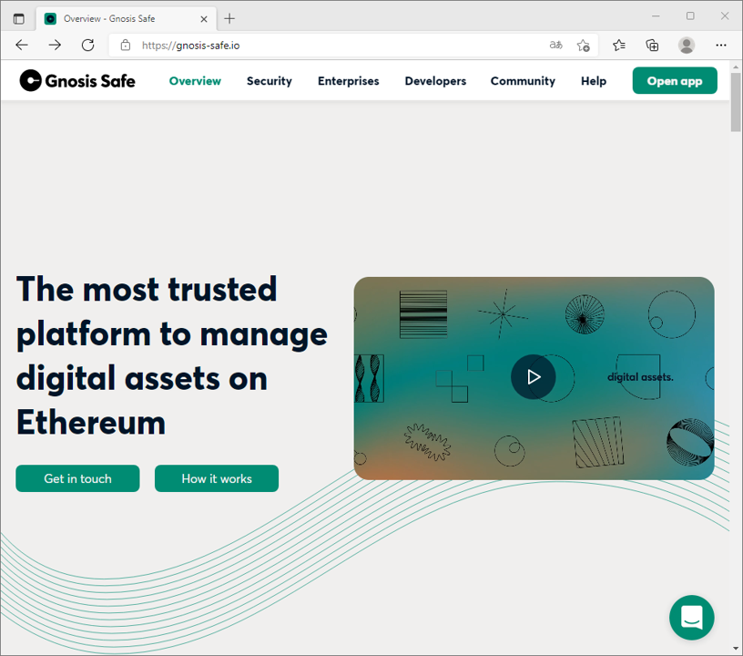

## 2、簡介 Gnosis Safe 多簽錢包可應用的場景
  Application scenarios of Gnosis Safe multi-signature wallet

- 自 2017 年 Gnosis 創立以來，不斷開發基於區塊鏈上的資產管理解決方案，Gnosis 開發的多簽錢包 Gnosis Safe 是在 Ethereum 乙太坊上管理數位資產最為信賴的平臺，有許多 DAO 去中心化自治組織用來管理服務。

- Gnosis Safe 允許定義多簽錢包（實際上是實現 EIP-712 和 EIP-1271 協定的智能合約錢包）的管理者列表，以及設置交易時需要的管理者確認閾值（例如：3 人中只需 2 人確認、5 人中只需 3 人確認），假設這筆轉帳收集了超過閾值數量的簽署確認，即可執行交易。

- 公司或團隊可更安全地將資金儲存在 Gnosis Safe 多簽錢包內，因為要求指定數量的管理者接受才能轉移資金。所以沒有一個管理者可以捲款跑路

- 公司或團隊可在大多數管理者的共識之下執行機敏交易

- 而個人可使用 Gnosis Safe 多簽錢包的多簽特性，來增加擁有助憶詞（或由助憶詞產生的子私鑰）的容錯程度，假設您遺失了其中一份助憶詞，您還可用剩下的兩份助憶詞來轉移資產

- 除了數位資產轉移外，Gnosis Safe 也內建多項 DAPPs 服務，如：Compound、Uniswap 等在這些應用上進行多簽管理；若所需的 DAPPs 不在內建列表，Gnosis Safe 亦可與支援 WalletConnect 開源協議的去中心化服務進行加密連線，如：Snapshot，讓多簽功能不中斷。

- 最後，Gnosis Safe 目前可支援 11 條不同的區塊鏈（含測試鏈），如：Ethereum、XDai、Polygon、Binance Smart Chain 等。

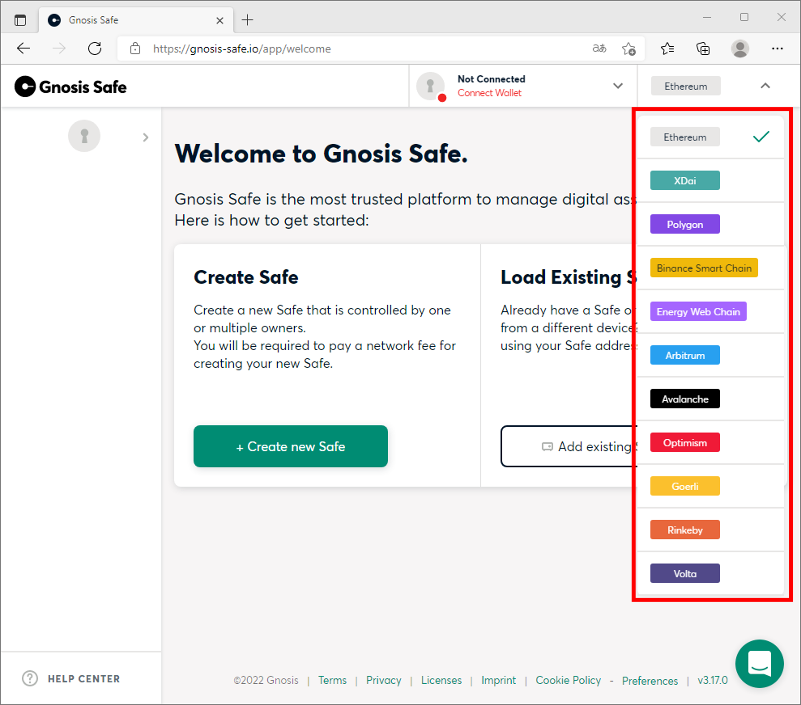

## 3、前置作業

### 安裝 Metamask 錢包，並創建在 Rinkeby Testnet 乙太坊測試網使用的錢包

- 本文使用的 Rinkeby 測試鏈可以使用 Faucet 水龍頭服務來領取免費的測試用 ETH 乙太幣

- 在瀏覽器中安裝 [Metamask](https://metamask.io/) 錢包

  - [Microsoft Edge](https://www.microsoft.com/zh-tw/edge) 版 Metamask 下載位置：[https://microsoftedge.microsoft.com/addons/detail/metamask/ejbalbakoplchlghecdalmeeeajnimhm](https://microsoftedge.microsoft.com/addons/detail/metamask/ejbalbakoplchlghecdalmeeeajnimhm)
  - [Google Chrome](https://www.google.com/intl/zh-TW/chrome/) 版 Metamask 下載位置：[https://chrome.google.com/webstore/detail/metamask/nkbihfbeogaeaoehlefnkodbefgpgknn](https://chrome.google.com/webstore/detail/metamask/nkbihfbeogaeaoehlefnkodbefgpgknn)
  - [Mozilla Firefox](https://www.mozilla.org/zh-TW/) 版 Metamask 下載位置：[https://addons.mozilla.org/zh-TW/firefox/addon/ether-metamask/](https://addons.mozilla.org/zh-TW/firefox/addon/ether-metamask/)

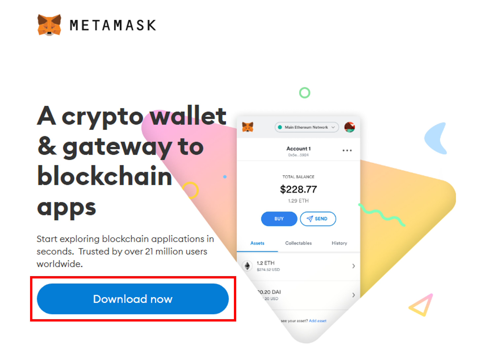

- 點選瀏覽器右上角的【Metamask 符號】→【開始使用】→【匯入錢包】→ 點選【No Thanks】捥拒收集匿名資訊

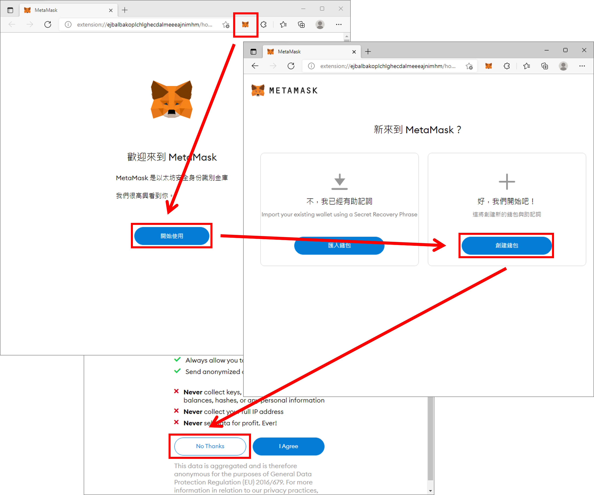

- 請輸入 2 次「Metamask 密碼」→ 勾選【I have read and agree to the 使用條款】→【建立】→ 看完介紹影片後點選【下一頁】→ 點選【點選顯示助憶詞】，並將顯示的 12 組助憶詞記錄下來（在這邊以：already across together hood nominee field more crush hen flee example cannon 助憶詞為例）→ 點選【下一頁】

  - 注意：實務上，助憶詞才是最重要、具有資產轉移的權限，這邊所輸入的密碼只是 Metamask 簽章前的臨時保護措施，關鍵還是助憶詞上的保管、勿輕易外洩！

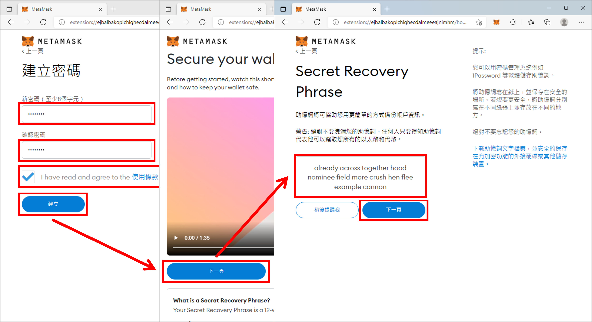

- 請【依序點選』上一步記下的助憶詞 →【確認】→ 點選【都完成了】完成 Metamask 新錢包的創建

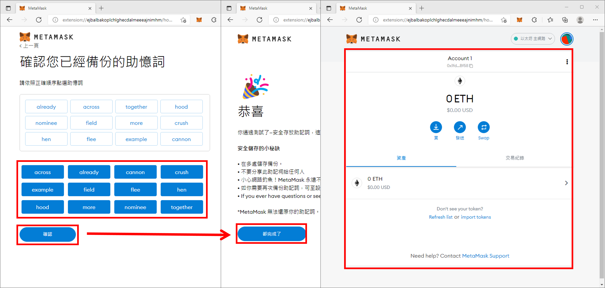

- 因為預設連線至 Ethereum Mainnet 乙太坊主網，餘額顯示為 0，所以要改為連線至 Rinkeby Testnet 乙太坊測試網路。請點選右上角【帳號】圖示 →【設定】→【進階】→【勾選】「Show test networks」以顯示測試網路

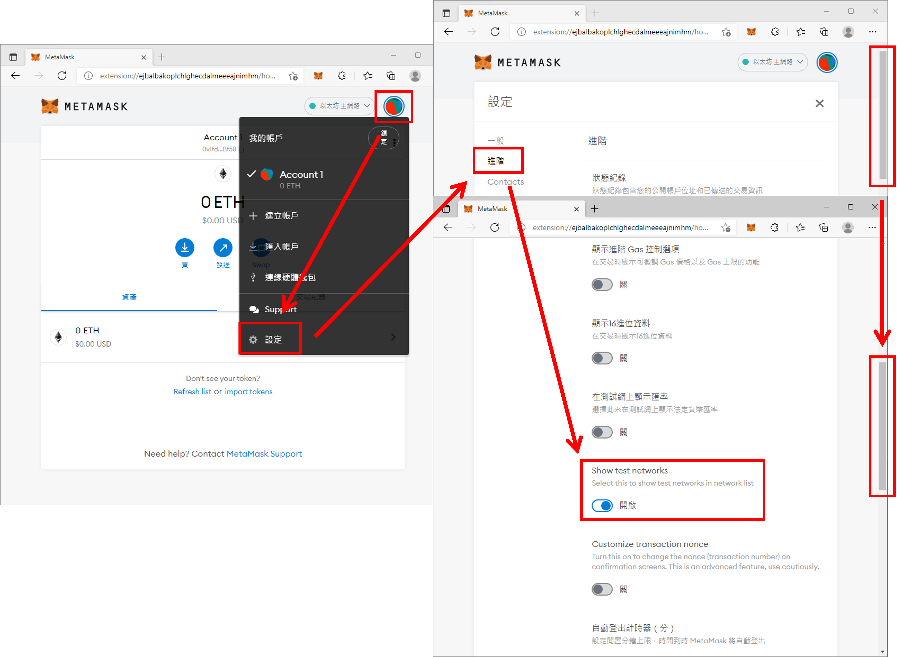

- 點選右上角的【Metamask 符號】→ 點選上方【網路圖示】→【Rinkeby】即可看到已切換至 Rinkeby 網路

### 透過 BIP-39 協定，使用上一步的助憶詞產生多個 account 錢包，以模擬多簽行為

- 比特幣 BIP-39 協定允許使用者透過調整 HD Wallet 的 Derivation Path，用同一組助憶詞來產生多組 Account 錢包，詳情可參考另一篇文章：「[詳解 HD Wallet、BIP-0032、BIP-0039、BIP-0043 及 BIP-0044](https://github.com/oneleo/awesome-blockchain-articles/tree/main/Explain%20the%20HD%20Wallet%E3%80%81BIP-0032%E3%80%81BIP-0039%E3%80%81BIP-0043%20%26%20BIP-0044%20in%20detail)」

- 將上一步所複製的助憶詞，貼在開源 [iancoleman/bip39](https://iancoleman.io/bip39/) 專案的「BIP39 Mnemonic」【欄位】→ 並將「Coin」改為【ETH - Ethereum】區塊鏈

  - 注意：實務上建議至 [iancoleman/bip39 Github](https://github.com/iancoleman/bip39/releases) 下載單機版「bip39-standalone.html」網頁，使用起來更為安全

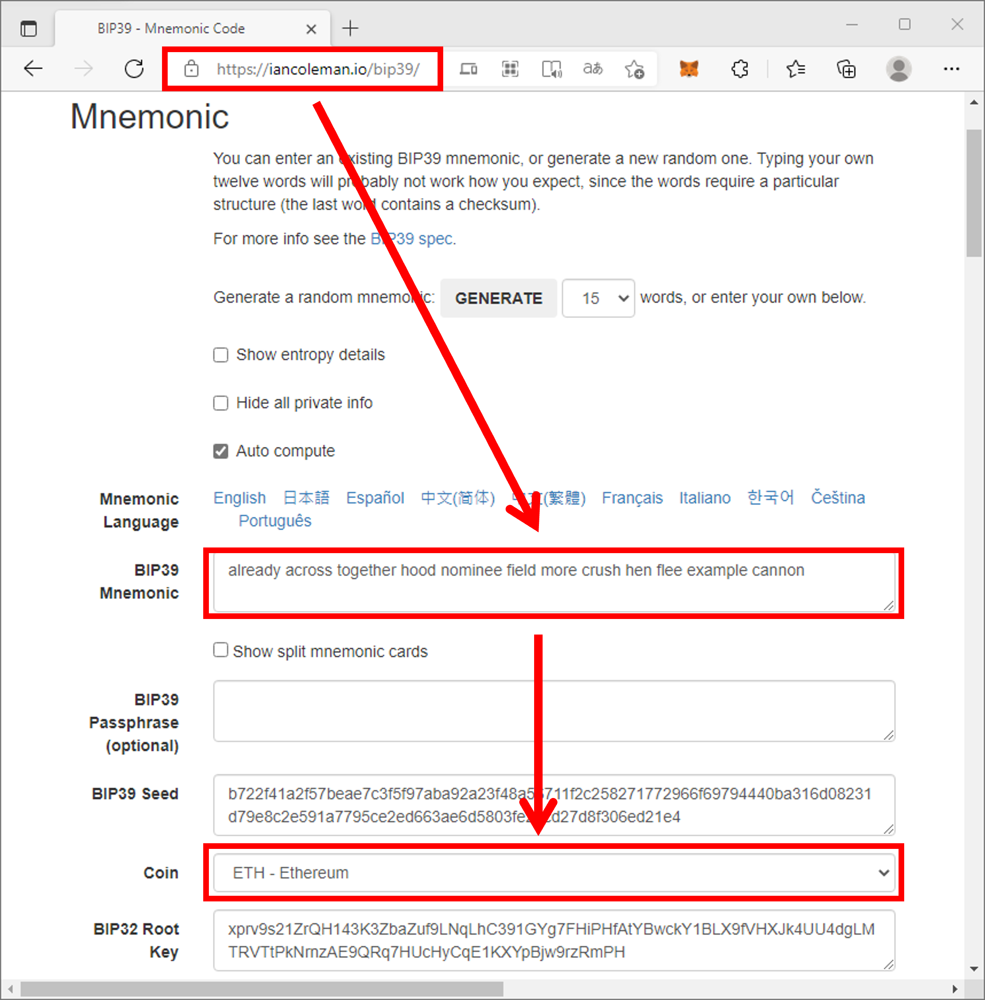

- 同樣在 iancoleman/bip39 頁面，將卷軸捲至下方的「Derived Addresses」區域，可以看到「m/44'/60'/0'/0/0」所顯示的 Address 地址要和 Metamask 的地址一致（右方為產生的子私鑰）

- 接下來我們要將「m/44'/60'/0'/0/1」到「m/44'/60'/0'/0/4」右方的子私鑰，依序輸入至 MetaMask 裡，以產生多組可供多簽的 Account 帳戶

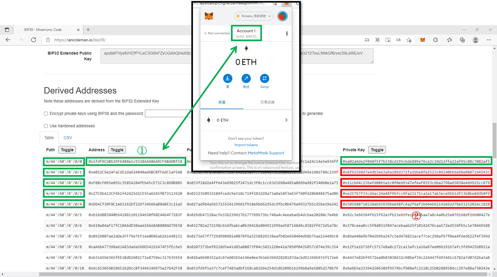

- 請點選 Metamask 右上角的【帳戶圖示】→ 點選【匯入帳戶】→ 將上一個步驟複製的其中一組子私鑰貼在「請貼上您的私鑰字串」【欄位】中 → 點選【匯入】，此時應可看到 MetaMask 多出了第 2 組帳戶

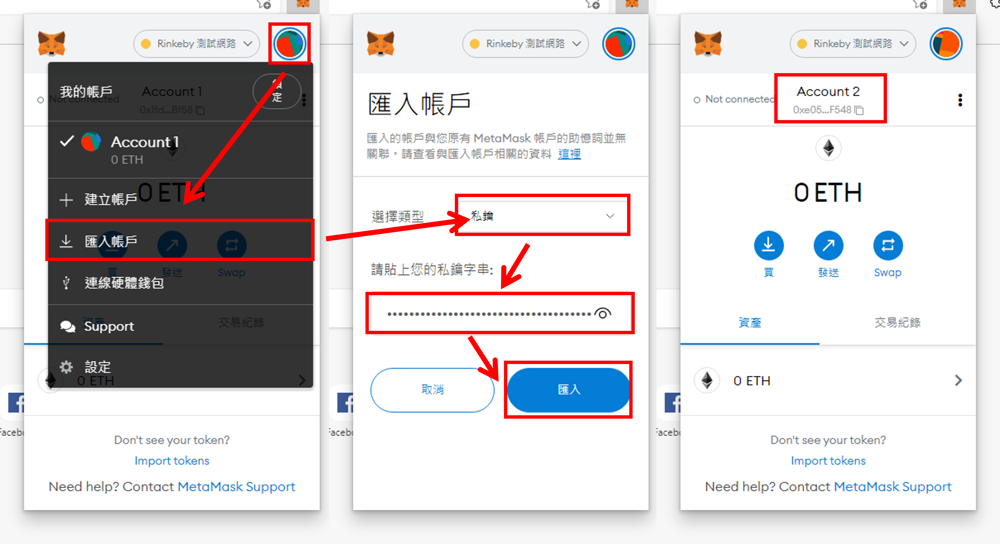

- 請按照上述方法，依序將「m/44'/60'/0'/0/1」到「m/44'/60'/0'/0/4」右方的子私鑰輸入到 MetaMask 中，最終會在 MetaMask 中看到總共 5 組帳戶（Account 1 至 Account 5）可供使用

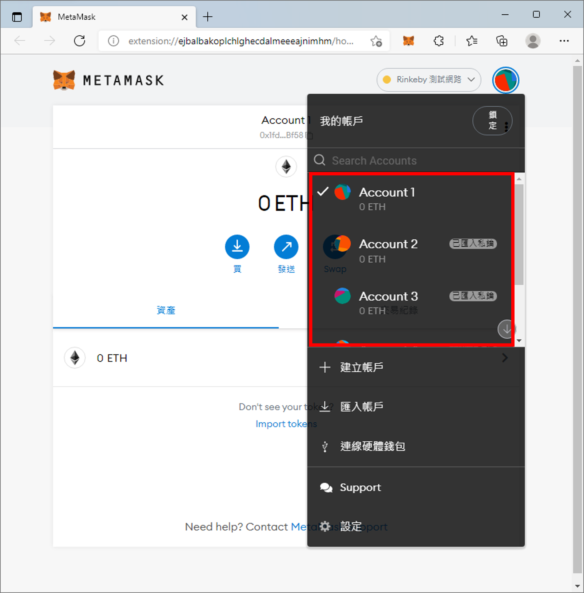

### 取得免費的 Rinkeby Testnet 測試網路用 ETH 幣

- 因為後面要建立 Gnosis Safe 多簽錢包，需要與乙太網路上的智能合約溝通，所以要先取得用於 Rinkeby 測試網用的 ETH 幣，才可以透過支付 Gas 手續費和智能合約互動

- 請至 Chain Link 提供的 [Rinkeby Faucets](https://faucets.chain.link/rinkeby) 水龍頭網站依序將 Account 1 至 Account 5 輸入以取得測試網乙太幣

- 請在「Network」點選【Ethereum Rinkeby】→【複製】MetaMask 上 Account 1 的地址 → 貼在「Testnet account address」【欄位】→【勾選】「0.1 test ETH」→【勾選】「我不是機器人」→完成 Google 免費勞工【驗證】→ 點選【Send request】

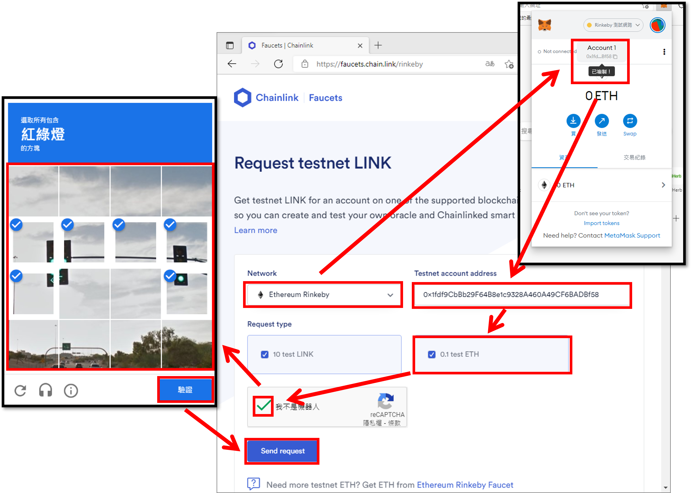

- 看到「Request complete」訊息後 → 即可【Close】關閉視窗 → 在 MetaMask 也看到 Account 1 獲得 0.1 顆測試用 ETH 幣

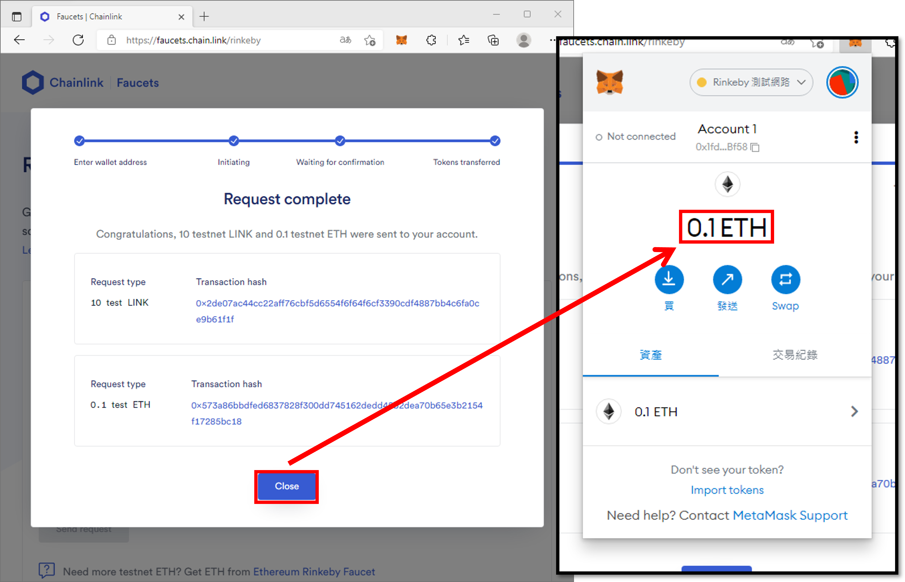

- 請依序將 Account 2 至 Account 5 輸入至 [Rinkeby Faucets](https://faucets.chain.link/rinkeby) 以各取得 0.1 顆 ETH 測試幣

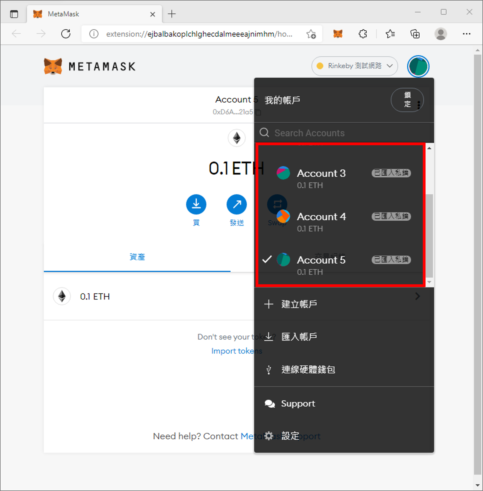

### 取得免費的 Rinkeby Testnet 測試網路用 NFT 非同質化代幣

- 因為後面會使用 Gnosis Safe 來演練多簽狀態下轉送 NFT，所以先取得用於 Rinkeby 測試網用的 NFT

- 請至 Scrappy Squirrels 團隊提供的 [Rinkeby Squirrels](https://rsq-frontend.vercel.app/) 網站，只需讓 Account 1 取得測試網 NFT

- 請點選 MetaMask 右上角的【帳戶圖示】→ 點選並切換至【Account 1】→ 點選【Connect to  Wallet】→ 確認已【勾選】「Account 1」→【下一頁】→ 點選【連線】

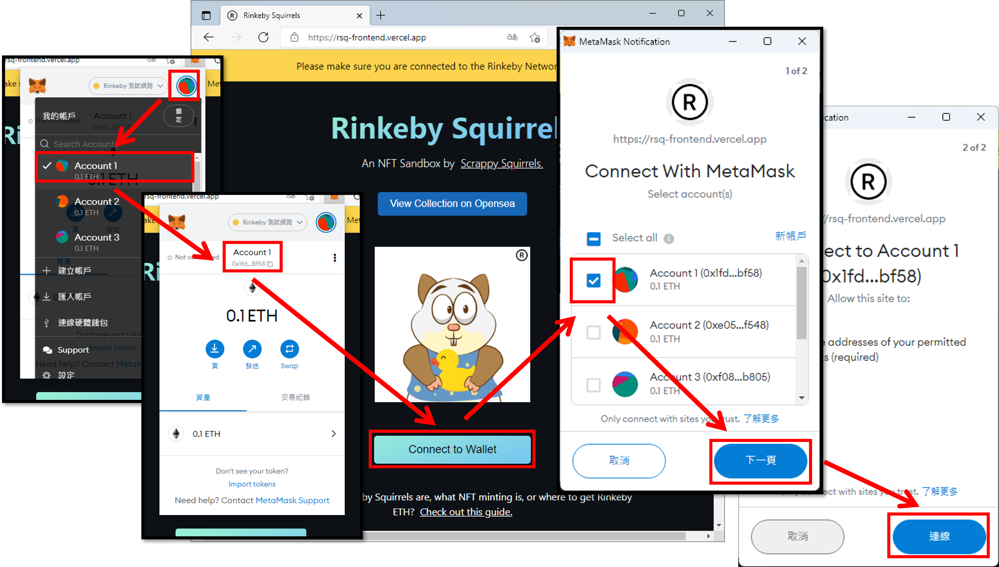

- 再點選【Mint a Rinkeby Squirrel NFT】鈕開始鑄造 → 鑄造 Squirrel NFT 最多需要約 0.01024（會因實際上執行的運算量而減少），點選【確認】開始支付，等待一陣子可以點選 MetaMask 的【交易紀錄】已完成 NFT 鑄造

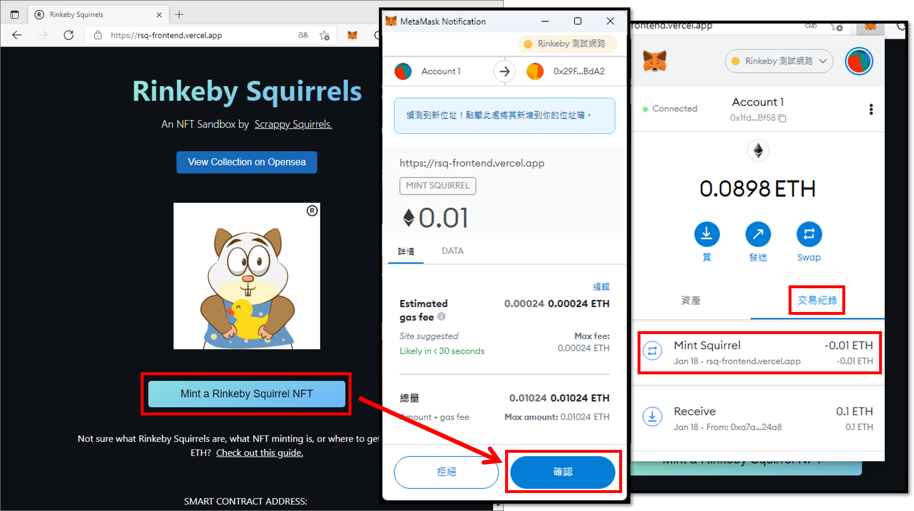

- 接下來即可以至 [OpenSea on Testnets](https://testnets.opensea.io/account) 上看到自己已完成鑄造的測試網 NFT

- 請點選連線【MetaMask】→【打勾】Account →【下一頁】→【連線】，即可看到自己在 Rinkeby 測試網上鑄造出的 NFT 了！

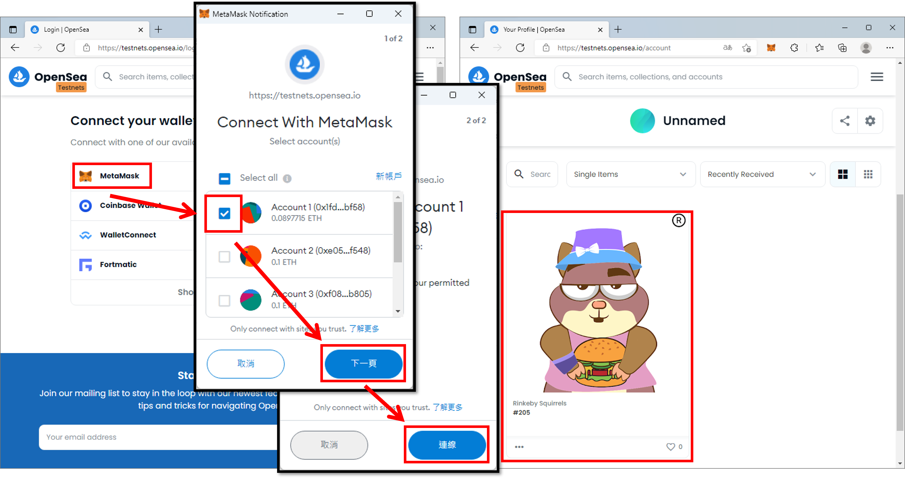

## 4、開始至 Gnosis Safe 建置一個多簽錢包
  Start to Gnosis Safe Create a Multisig Wallet

- 本處將使用 MetaMask 的「Account 2」、「Account 3」、「Account 4」三個帳戶來建置一個多簽錢包，並且限制其中 2 個帳戶允許轉帳時將交易送出

- 請至「[Gnosis Safe](https://gnosis-safe.io/)」官網，在建立多簽錢包前，先點選切換至 MetaMask 上的【Account 2】→ 再點選網站右上角【Open app】鈕

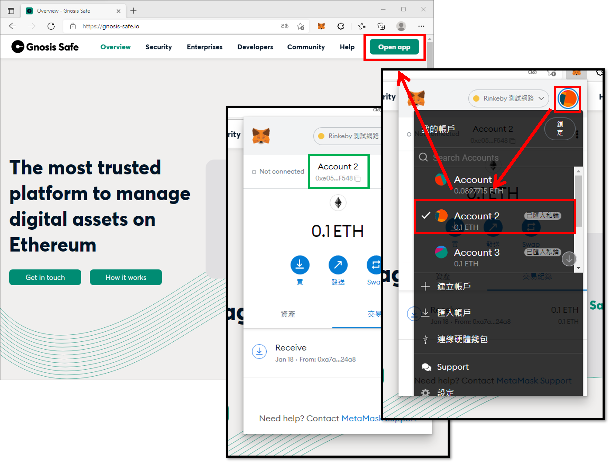

- 首先點選 APP 網站右上角的【網路圖示】→ 點選切換至【Rinkeby】網路 →點選【+ Create new Safe】鈕

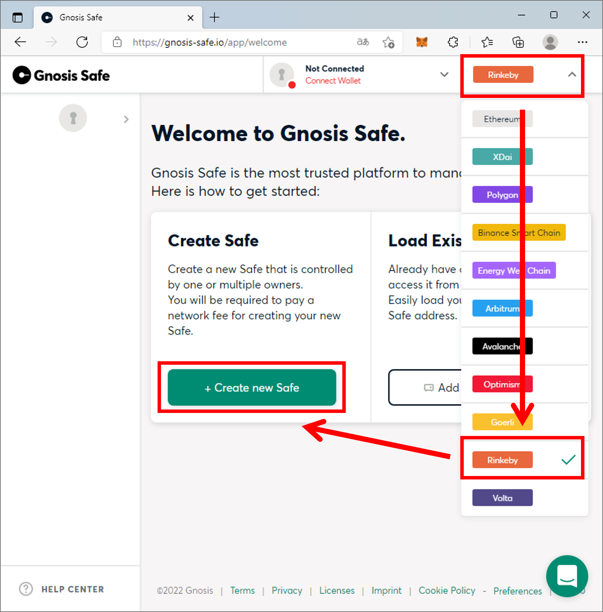

- 請點選【Connect】→ 點選【Metamask】→ 確定【勾選】「Account 2」→【下一頁】→【連線】

  - 注意：這邊可以看到，若想提升安全性至極致，是可以連結使用像是 Ledger、Trezor 等硬體錢包來建立多簽錢包的

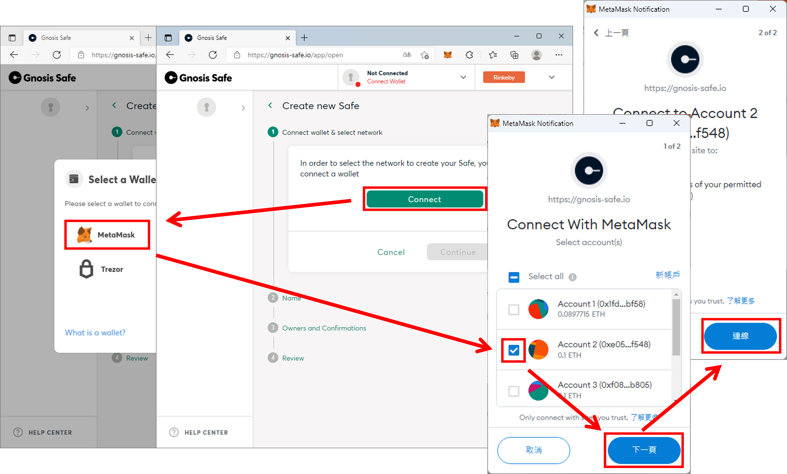

- 請點選【Continue】→ 在「Safe name」中輸入名稱【Safe Test】（可自由取名）→【Continue】→ 在「Owner Name」中輸入【Account 2】→ 點選【+ Add another owner】以增加此多簽錢包的其他管理者

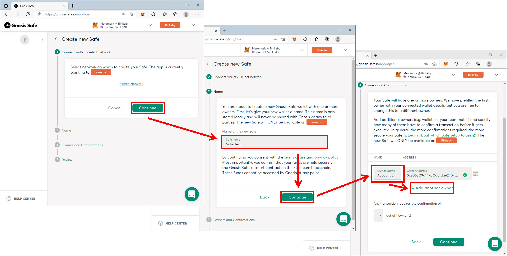

- 將「MetaMask」內的「Account 3」地址【複製】到 Safe Test 錢包第二格，並將「Owner Name」取名為【Account 3】→ 將「Account 4」地址【複製】到 Safe Test 錢包第三格，並將「Owner Name」取名為【Account 4】→ 點選「【2】out of 3 owner(s)」將同意數量閾值設置在 2 位管理者 → 確認 MetaMask 已切換回【Account 2】→ 點選【Continue】繼續

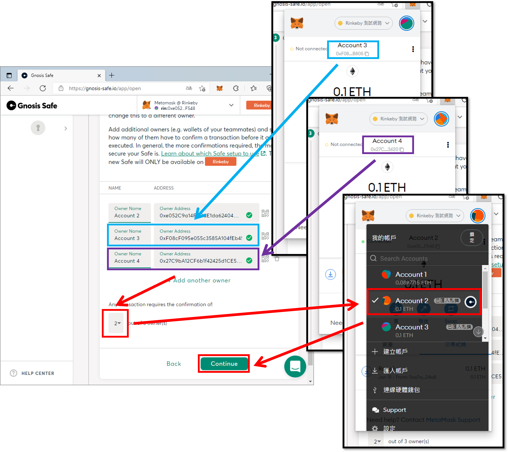

- 確認資訊無誤後，即可點選【Create】進行 Safe Test 錢包的建置 → 點選【確認】→ 點選【Get started】→ 點選【Continue】開始使用

  - 注意：本處在 Rinkeby 測試網上建置出來的 Safe Test 錢包（其實是一份智能合約），就只適用於 Rinkeby 測試網上使用，若是將其他網路，如：Mainnet 主網上的資產傳送至此 Safe Test 錢包內，將直接遺失（因為 Mainnet 主網上並沒有此份智能合約），實際上操作時需非常當心所在的網路位置！

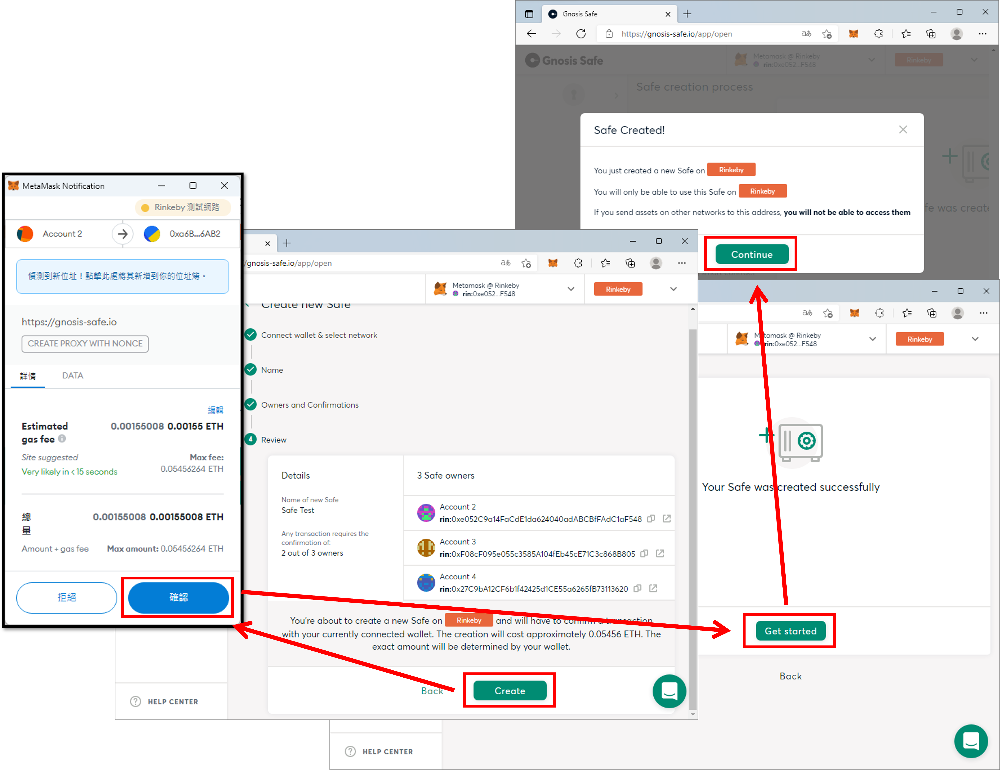

- 因為在 Rinkeby 網上使用 Gnosis Safe 錢包地址前方會帶有「rin:」前綴字，為方便後續操作，我們可以設定不要複製到「rin:」前綴字，請點選左側【SETTINGS】→【Appearance】→【取消勾選】「Copy addresses with chain prefix.」

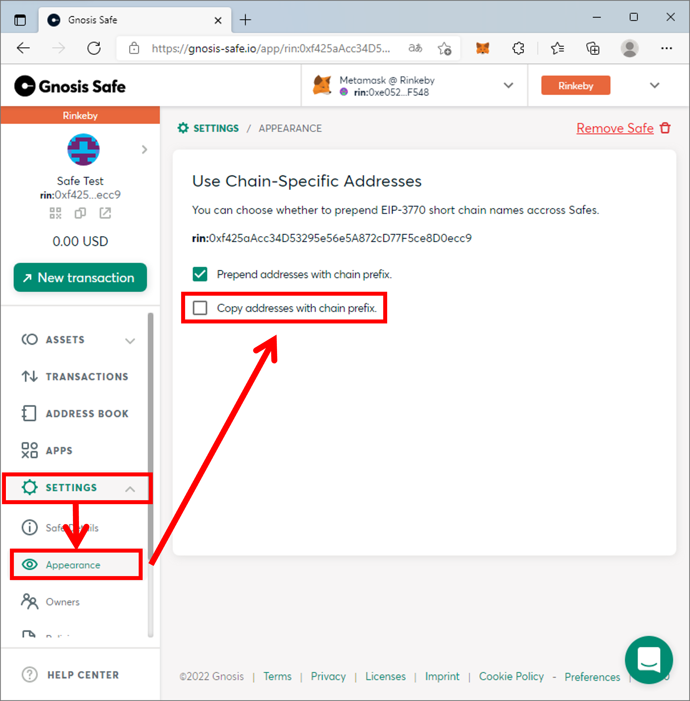

- 若對 Gnosis Safe 多簽錢包感興趣，在建置自己的 Gnosis Safe 多簽錢包其實是呼叫 Gnosis Safe Proxy 智能合約（在 Rinkeby 網上的 Gnosis Safe Proxy 位置在：[0xa6b71e26c5e0845f74c812102ca7114b6a896ab2](https://rinkeby.etherscan.io/address/0xa6b71e26c5e0845f74c812102ca7114b6a896ab2)（每一個在 Rinkeby 測網上都一樣））來建置「多簽錢包合約」（執行「createProxyWithNonce(_singleton, initializer, saltNonceWithCallback);」此 Write 函數來產生，本處多簽錢包合約位置在：[0xf425aAcc34D53295e56e5A872cD77F5ce8D0ecc9](https://rinkeby.etherscan.io/address/0xf425aAcc34D53295e56e5A872cD77F5ce8D0ecc9)（每一個人的位置均不會相同））

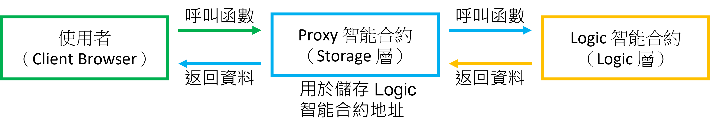

- 以 Proxy 智能合約部署的「[Proxy 合約設計模式](https://blog.openzeppelin.com/proxy-patterns/)」可以降低部署程式碼的計算成本（Gas 手續費），將合約拆開為 Storage（Proxy 合約）及 Logic（錢包合約）兩大部份，同時也降低了程式碼的重覆次數（因為 Logic 合約程式碼大家都是相同的

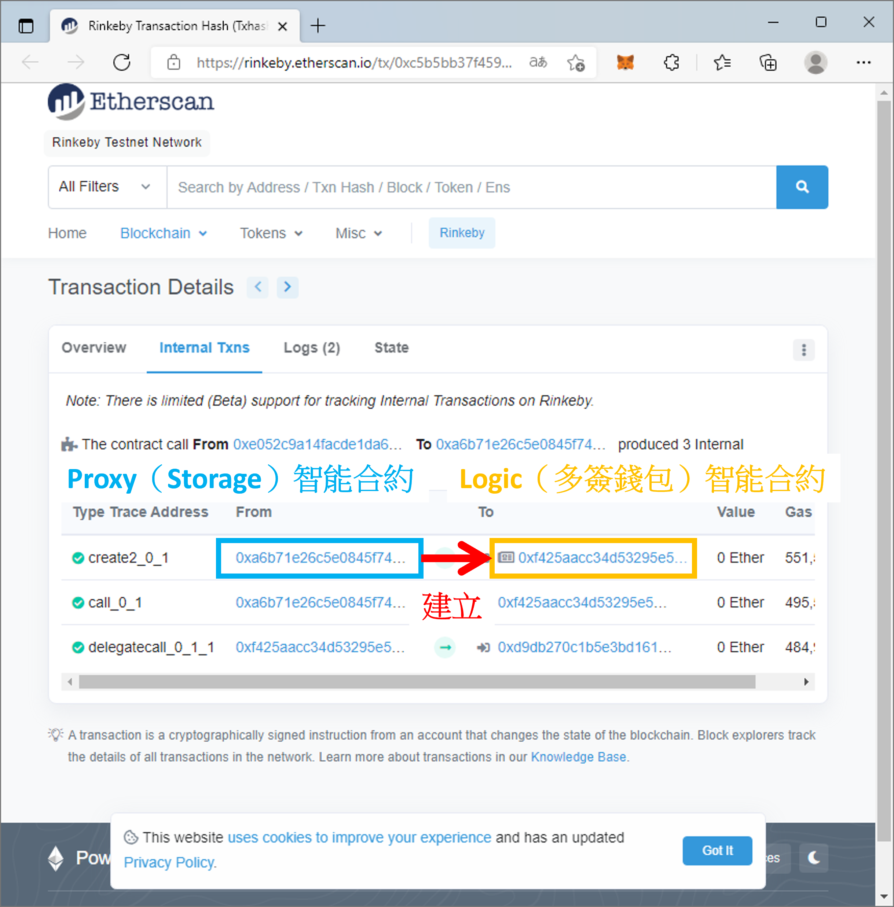

## 5、將「Account 1」的資產及 NFT 轉到「Safe Test」多簽錢包
  Transfer "Account 1" assets and NFT to "Safe Test" multi-signature wallet

- 接著為實現將「Safe Test 錢包」轉帳至「Account 5」，首先將「Account 1」的測試用 ETH 及 NFT 轉移至「Safe Test 錢包」內

- 請【複製】Safe Test 錢包地址 → 點選 MetaMask 右上角【帳戶圖示】確認現在為【Account 1】→ 點選【發送】鈕 → 貼上【Safe Test 錢包地址】→ 在「數量」輸入【0.05】→【下一頁】→【確認】

- 待交易完成後，即可在 Safe Test 錢包點選【ASSETS】→【Coins】看到「0.05 測試 ETH」資產已入帳

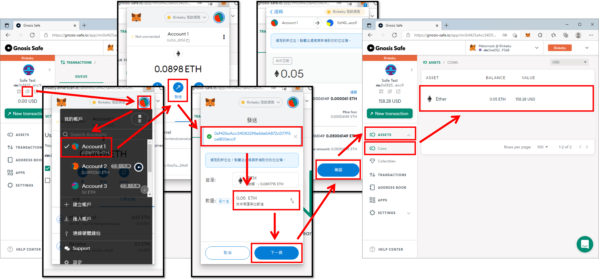

- 再來請至 [OpenSea on Testnets](https://testnets.opensea.io/account) 點選測試網 NFT 左下角的【…】符號 →【Transfer】→ 點選下方【Transfer】→ 輸入【Safe Test 錢包地址】→【確認】

- 待交易完成後，即可在 Safe Test 錢包點選【ASSETS】→【Collectibles】看到「測試 NFT」資產已轉入

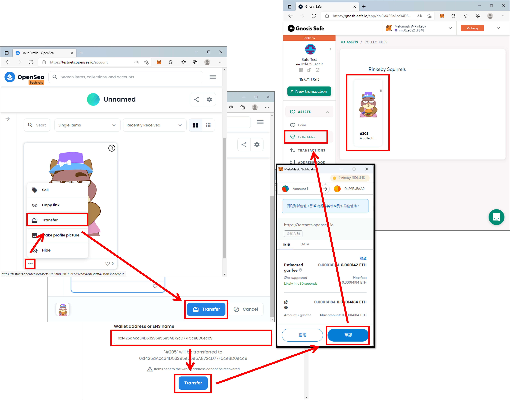

## 6、協調「Safe Test」多簽錢包的 3 位管理者，將其中的 0.01 ETH 及 NFT 轉出至「Account 5」
  Coordinated the 3 managers of the "Safe Test" multi-signature wallet, and transferred 0.01 ETH and NFT to "Account 5"

- 本處情境為「Account 2」同意轉帳、「Account 3」同意轉帳，以達成轉帳協議，將其中的 0.01 ETH 及 NFT 轉出至「Account 5」

- 請點選 MetaMask 右上角【帳戶符號】→ 點選下方【Account 5】→ 再點選上方【Account 5】以複製 Account 5 地址

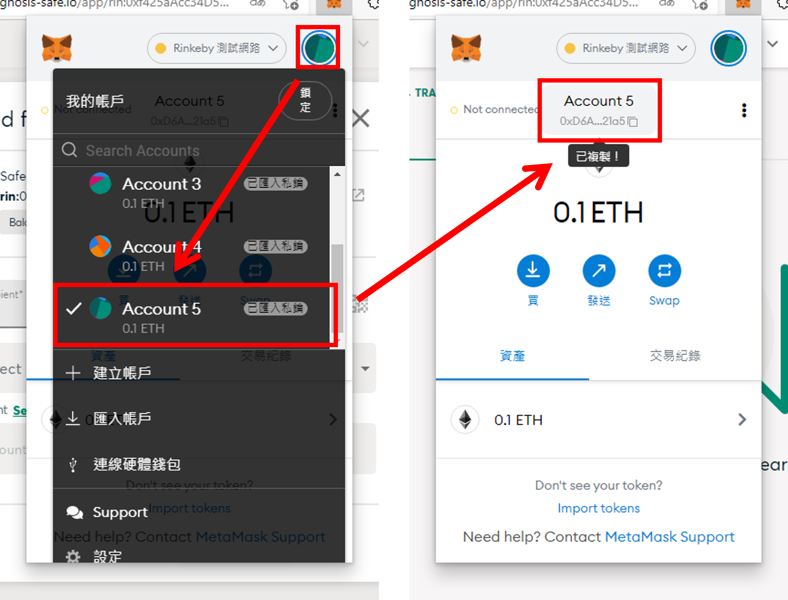

- 請點選 MetaMask 右上角【帳戶符號】→ 點選下方【Account 2】切換至 Account 2 → 再點選 Safe Test 錢包左側【New transaction】→【Send funds】

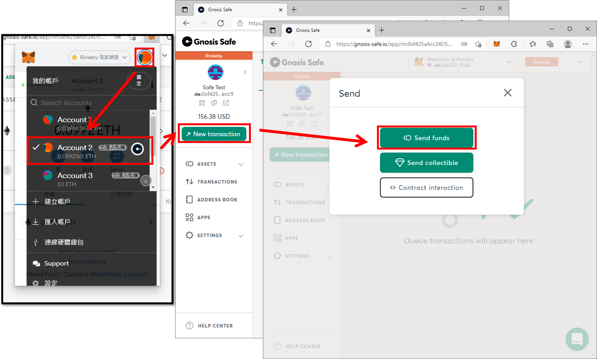

- 請將剛才複製的 Account 5 地址【貼上】在「Recipient」欄位 → 點選【Ether】代幣 → 數量是【0.01】→ 點選【Review】→【簽署】，可以看到 Safe Test 錢包正在等待其他管理者同意或拒絕

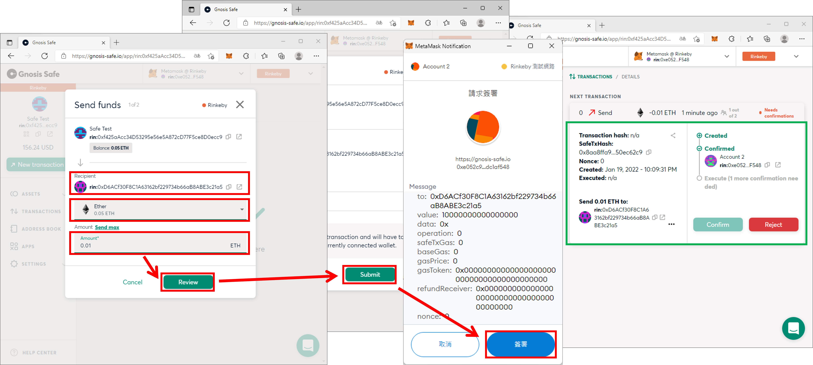

- 請點選 MetaMask 右上角【帳戶符號】→ 點選下方【Account 3】切換至 Account 3 → 再點選【連線】將 Account 3 連線至 Safe Test 錢包 → 確認上方顯示的是「Account 3」的地址後，請點選下方【Confirm】鈕 →【勾選】「Execute transaction」由 Account 3 負責支付本次交易的手續費 →【Submit】→ 點選【確認】後，等待一會兒即可看到交易完成

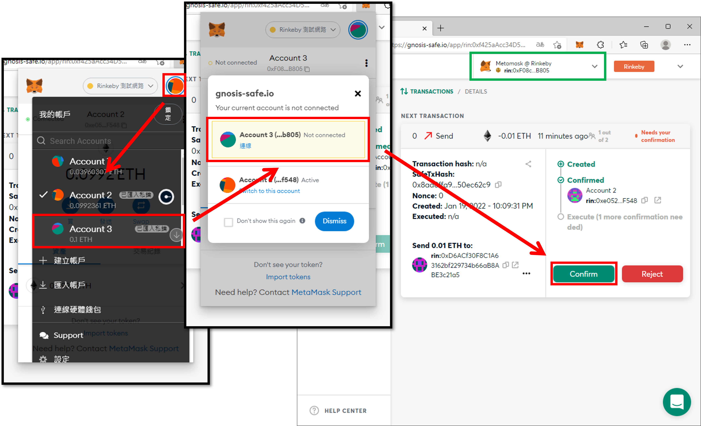

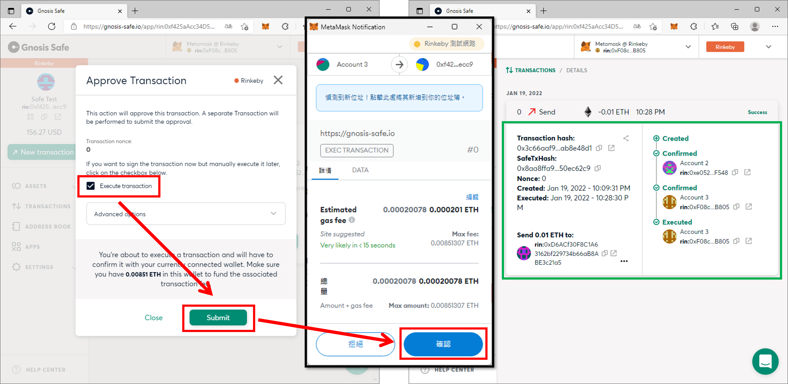

- 此時即可看到 Account 5 的餘額從原先的 0.1 ETH 增加為 0.11 ETH，完成這次的 Safe Test 的 ETH 轉帳

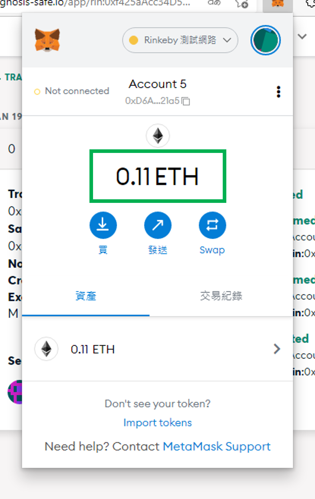

- 同樣的，接著請點選 MetaMask 右上角【帳戶符號】→ 點選下方【Account 2】切換回【Account 2】→ 再點選 Safe Test 錢包左側【New transaction】→【Send collectible】

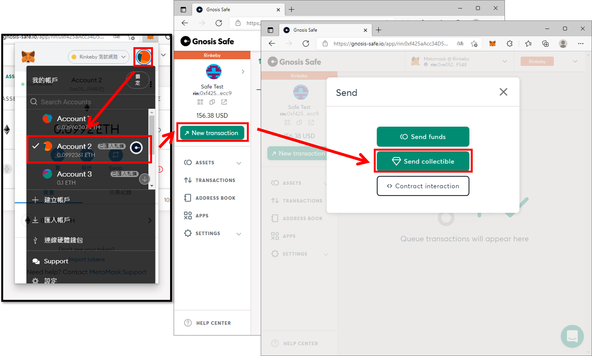

- 請將剛才複製的 Account 5 地址【貼上】在「Recipient」欄位 → 點選【Rinkeby Squirrels】發行商 →【#205 NFT】→ 點選【Review】→【Submit】→【簽署】，可以看到 Safe Test 錢包正在等待其他管理者同意或拒絕

- 若是不小心將瀏覽器關閉，可以從 Safe Test 錢包左側的【TRANSACTIONS】→ 右側的【QUEUE】中看到正在等候的交易

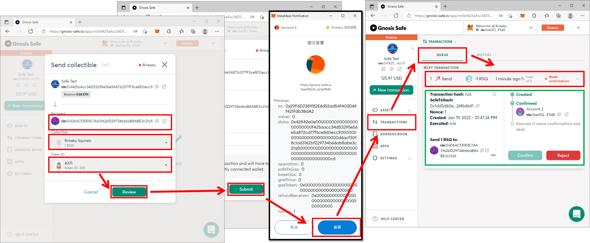

- 請點選 MetaMask 右上角【帳戶符號】→ 點選下方【Account 3】切換至 Account 3 → 確認上方顯示的是「Account 3」的地址後，請點選下方【Confirm】鈕 →【勾選】「Execute transaction」由 Account 3 負責支付本次交易的手續費 →【Submit】

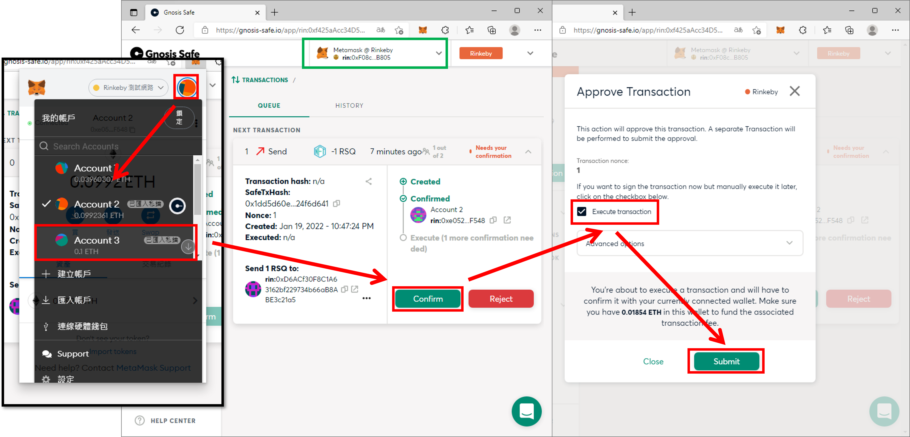

- 請點選【確認】後，等待一會兒即可看到交易完成 → 此時可以從【TRANSACTIONS】→ 右側的【HISTORY】中看到已完成的交易

- 這時就可以用 Account 5 登入到 [OpenSea on Testnets](https://testnets.opensea.io/account) 網站看到已順利取得 NFT 了！

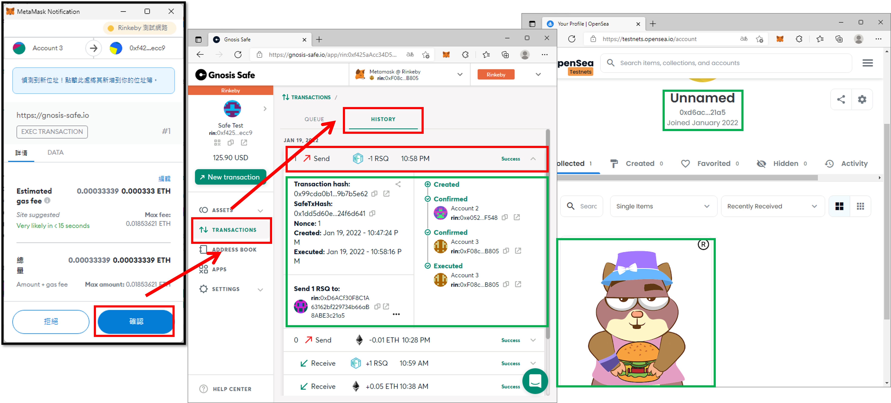

## 7、協調「Safe Test」多簽錢包的 3 位管理者，將其中的 0.01 ETH 質押至 Compound 服務
  Coordinated the 3 managers of the "Safe Test" multi-signature wallet to pledge 0.01 ETH to the Compound service

- 本處情境為「Account 2」同意質押、「Account 3」不同意、「Account 4」同意質押，以達成質押協議

### 什麼是 Compound？

- Compound 是去中心化金融（DeFi）上的借貸平台

  - 去中心化金融 DeFi 是以智能合約取代傳統的金融服務，過去金融機構透過存款者的資金放貸給借款者，以賺取中間利息。一旦以 DeFi 取代傳統中心化金融，就能自動化處理，除了區塊鏈上每筆交易都透明公開，還可去除中介者不合理抽傭，將大多數利息回饋給存款者

  - Compound 正是以智能合約進行透明公開的借貸交易，分為存款者存入密碼貨幣、放貸賺取利息，借款者抵押密碼貨幣資產以進行借貸投資。

  - 存款者存入 ETH 可取得 cETH 代幣，存款者可使用 cETH 贖回含利息的 ETH

  - 借款者抵押如 USDT 來立刻取得 ETH 放款，不需等待且借貸利率低

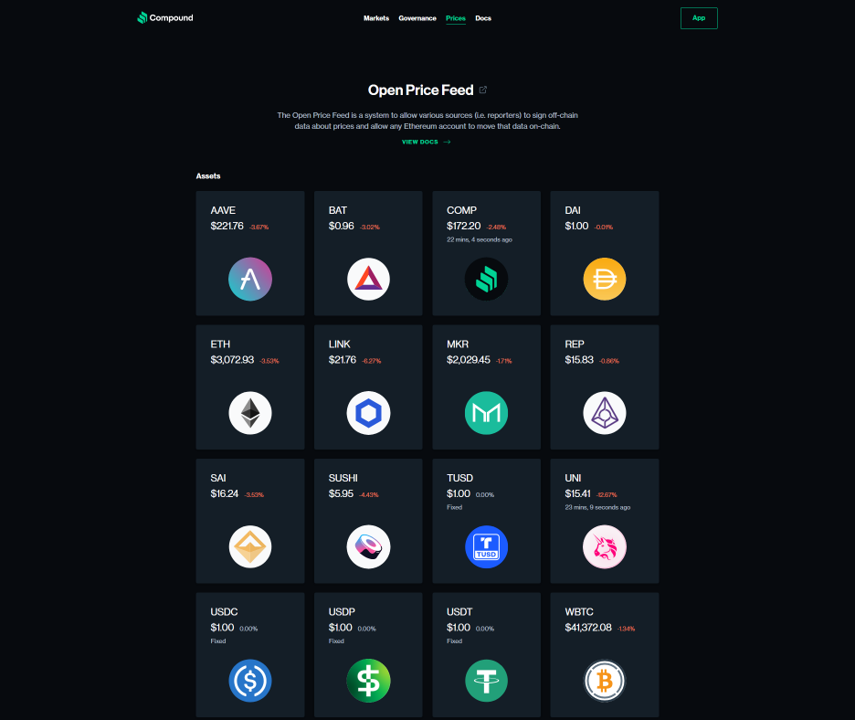

### 將 Safe Test 連接至內建的 Compound APPs 並進行 0.01 ETH 的質押

- 請點選 MetaMask 右上角【帳戶符號】→ 點選下方【Account 2】切換至 Account 2 → 確認上方顯示的是「Account 2」的地址後，請點選左側【APPS】→ 點選右側的【Compound】

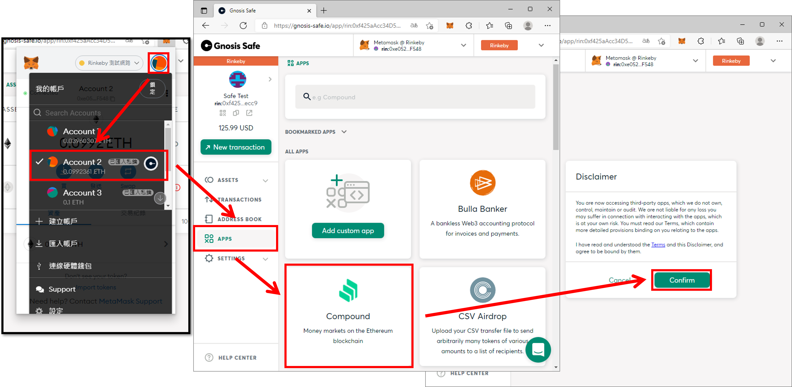

- 點選【ETH】幣 → 點選【SUPPLY】質押 → 設置【0.01】顆 →【Supply】→【Submit】→【簽署】

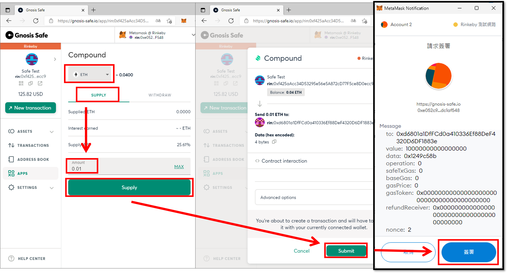

- 接著我們要讓 Account 3 拒絕，請點選 Safe Test 左側【TRANSACTION】→ 點選右側【QUEUE】→ 點選【Compound mine】→ 因為此時還是 Account 2 帳戶，所以要點選 MetaMask 右上角【帳戶圖示】→【Account 3】切換到 Account 3 → 點選【Reject】拒絕 →【Reject transaction】→【簽署】即完成 Account 3 的拒絕動作

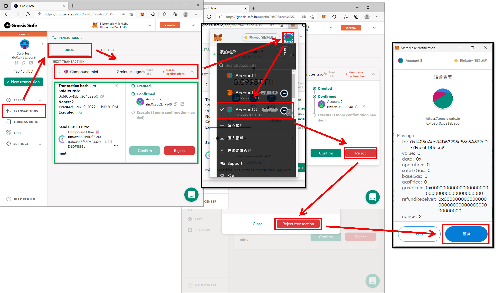

- 緊接著要讓 Account 4 允許，請點選 MetaMask 右上角【帳戶圖示】→【Account 4】→【連接】以切換到 Account 4 → 因為上一步停留在「是否要拒絕此交易」畫面，所以要重新點選 Safe Test 左側【TRANSACTION】→ 點選右側【QUEUE】→ 點選【Compound mine】（不是「ON-CHAIN REJECTION」）→ 點選【Confirm】→ 點選【Execute transaction】由 Account 4 來支付手續費 →【Submit】→【確認】

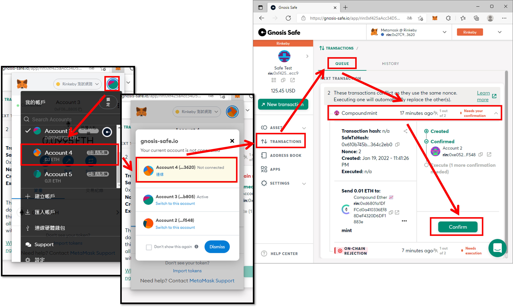

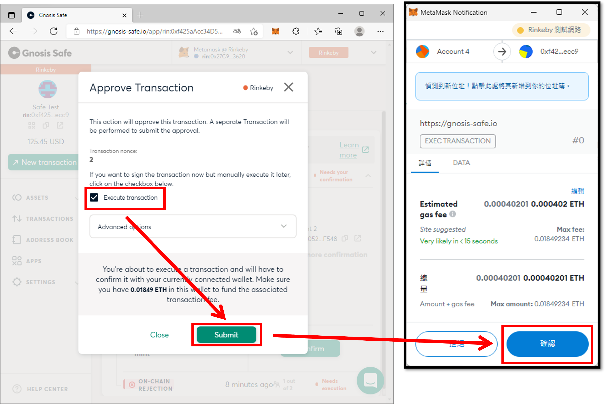

- 因為 3 個管理者中有 2 位允許即可接受本次質押，可以在【TRANSACTION】→【HISTORY】看到本次質押已允許，並且可以從【ASSETS】→【Coins】中看到從 Compound 返回的 cETH 代幣

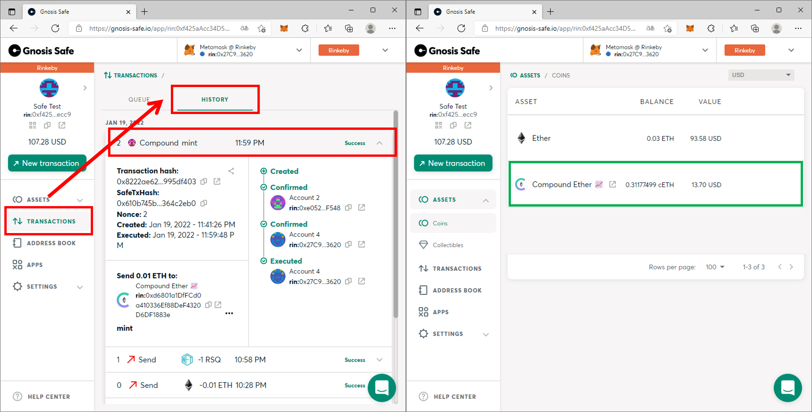

## 8、將「Safe Test」多簽錢包透過 WalletConnect 開源協議，連接至 Snapshot 服務
  Connect the "Safe Test" multi-signature wallet to the Snapshot service through the WalletConnect open source protocol

### 什麼是 Snapshot？

- Snapshot 是去中心化治理組織 DAO 最喜愛用的投票平台 

  - 去中心化治理組織 DAO（Decentralized Autonomous Organization）的決策均由代幣持有者共同投票決定，不會受到中心化政府或組織控制。DAO 從營運治理、日常運作及付款時程等，皆由智能合約自動執行，除了達到民主、公平的目標，還可簡化程序上的流程

  - Snapshot 是一個用於「提案」和「投票」的鏈下無手續費（Gas）的治理工具，透過持有代幣的社群或個人，可簡化治理流程及提升參與度。Snapshot 會透過所有參與者錢包位址持有的代幣數量，對不同提案進行加權投票

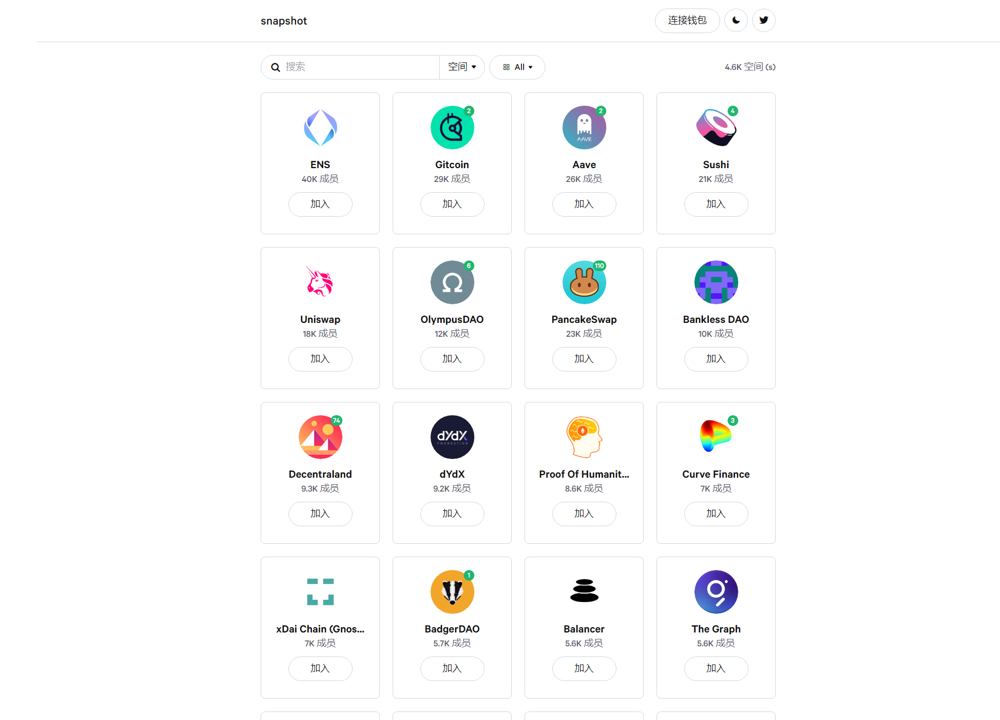

### 透過 WalletConnect 開源協議，將「Safe Test」錢包連接至 Snapshot 服務

- 因為 Gnosis Safe 沒有內建 Snapshot APP，所以要使用 WalletConnect 開源協議來連線，請先到 [Snapshot](https://snapshot.org/) 官網 → 點選【連接錢包】→ 點選【WalletConnect】→ 點選【複製到剪貼板】

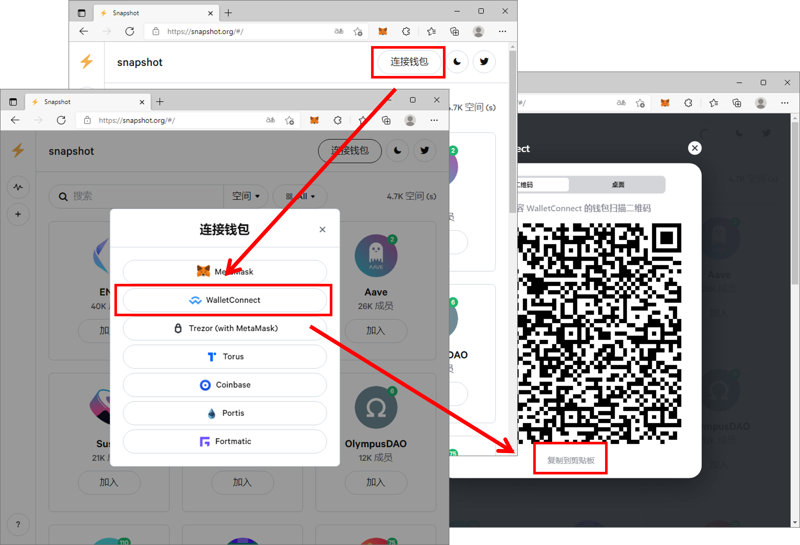

- 回到 Safe Test 錢包，請先點選 MetaMask 右上角【帳戶圖示】→ 點選【Account 2】切換到 Account 2 → 點選【APPS】→【WalletConnect】→ 在「Wallet Connect」下方【貼上】剛才複製的連接資訊，即可看到 Snapshot APP 已完成連線

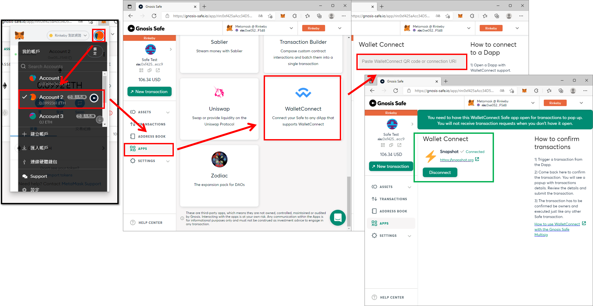

- 再次來到 [Snapshot](https://snapshot.org/) 網站，可以看到我們的 Safe Test 錢包已完成和 Snapshot DAPP 連線，即可進行後續的「提案」與「投票」了！

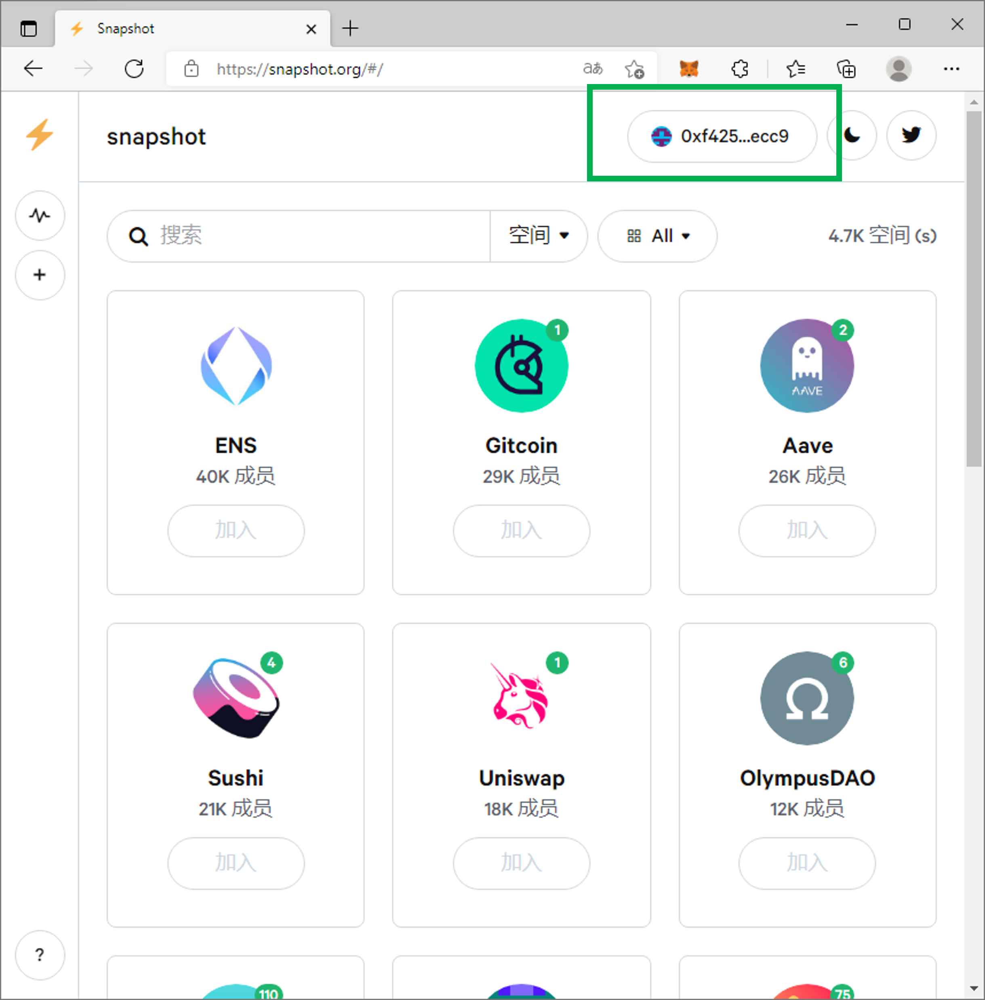

## 9、將「Safe Test」多簽錢包透過 WalletConnect 開源協議，連接至 The Graph 服務，並且協調「Safe Test」多簽錢包的 3 位管理者，將其中的 0.01 ETH 用作 Curator 來 Signal 其中一項 Subgraph
  Connect the "Safe Test" multi-signature wallet to The Graph service through the WalletConnect open source protocol, and coordinate the 3 managers of the "Safe Test" multi-signature wallet to use 0.01 ETH as a Curator to Signal one of the Subgraphs

- 本處情境為「Account 2」同意 Signal、「Account 3」不同意、「Account 4」不同意，以取消成為 Curator 的支出

### 什麼是 The Graph？

- The Graph 是區塊鏈上的 GraphQL API 搜尋引擎，主要由 5 種角色組成

  - Developer：DAPPs 項目方，為讓自家的 DAPPs 被推廣及被搜尋，會在 The Graph 上建立 Subgraph，藉此紀錄 DAPPs 資料在以太坊上的位置、及資料的儲存格式
  - Indexer：索引節點維護者，負責提供索引的建立與查詢，並收取查詢手續費作為收入
  - Curator：評估 Developer 建置的 Subgraph 是否值得採用（透過 Signal），告訴 Indexer 可以索引這些 Subgraph，且 Curator 可取得部份查詢手續費作為正確標記 Subgraph 的獎勵
  - Delegator：質押手中的 GRT 給 Indexer，並收取利息作為收入
  - Consumer：支付 GRT 進行指定 Subgraph 的查詢

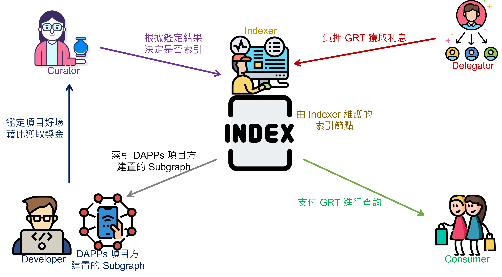

### 取得免費的 The Graph Testnet 測試網路用 GRT 代幣

- 為免費取得在 Rinkeby 測試網上的 GRT 代幣，需先點選加入 [The Graph Discord](https://discord.gg/vtvv7FP) 

- 請輸入 Discord【使用者名稱】→【繼續】→【勾選】我不是機器人 → 輸入出生【年】【月】【日】→【電子郵件】（可使用[臨時信箱](https://temp-mail.org/)服務）、【密碼】→【下一步】→ 到信箱點選【驗證電子郵件】

- 進到 The Graph Discord 後，點選下方【完成】→【勾選】「我已詳閱並同意規則」→【提交】→ 點選左側【verify】頻道 → 送出【/verify】訊息 → 此時會有驗證機器人私訊，對他送出顯示的【驗證碼】以完成驗證 → 點選左側【roles】頻道 → 按下【T】鈕以成為測試成員 → 點選左側【testnet-faucet】頻道 → 輸入【!grt <Safe Test 錢包地址>】

- 可以看到已在 Safe Test 錢包內收到 100000 顆 GRT 測試幣了

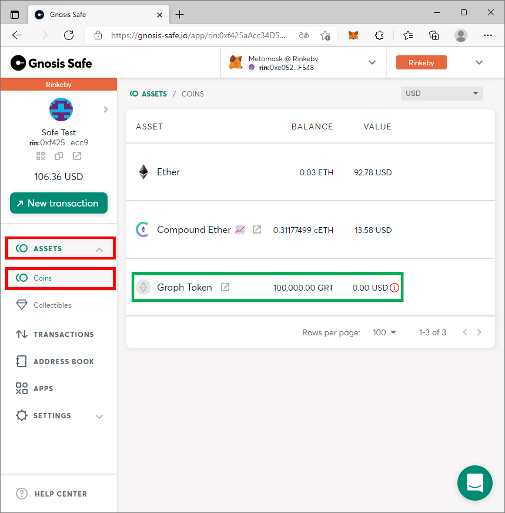

### 透過 WalletConnect 開源協議，將「Safe Test」錢包連接至 The Graph 服務

- 

### 協調「Safe Test」多簽錢包的 3 位管理者，將其中的 0.01 ETH 用作 Curator 來 Signal 其中一項 Subgraph

-

## 10、總結
  Conclusion
  
- Gnosis Safe 為 DeFi 領域提供更為安全的錢包選擇
- 您甚至可搭配 Ledger、Trezor 等硬體錢包成為 Gnosis Safe 的管理者之一
- 因為支援 WalletConnect 開源協議，所以可支援各式主流的 DAPPs 服務
- 不論是團體、還是個人使用都有可提升安全性的應用情境
- 透過 Gnosis Safe 可更利於維護公司提供的 DAPPs 服務，不易有管理者監者自盜的情形發生

## 11、本文架構
  Architecture of this article

## 12、參考文獻
  References

- Gnosis Safe
  - [Gnosis Safe](https://gnosis-safe.io/) 官網
  - 0xAA（People DAO）- [DAO 工具 #1: Gnosis Safe 多簽錢包](https://mirror.xyz/people-dao.eth/nFCBXda8B5ZxQVqSbbDOn2frFDpTxNVtdqVBXGIjj0s)
  - 以太坊愛好者（鏈報）- [以太坊上的數字簽名](https://www.chaindaily.cc/posts/a2d53ecf8b06c984426669fa06e9fe40)
  - 深入淺出區塊鏈（gushiciku）- [Genosis Safe](https://www.gushiciku.cn/pl/gwyc/zh-tw)
  - 深入淺出區塊鏈（gushiciku）- [手動構造 Gnosis 多籤交易](https://www.gushiciku.cn/pl/ageM/zh-tw)
  - 深入淺出區塊鏈（gushiciku）- [GnosisSafe - 合約結構分析](https://www.gushiciku.cn/pl/g9c5/zh-tw)

- Compound
  - [Compound](https://compound.finance/) 官網
  - 懶人經濟學 - [Compound 介紹：最大 DeFi 借貸平台，使用就能領 COMP 挖礦！在 Compound 享超優惠利率借貸及穩定獲利放貸！](https://earning.tw/what-is-compound/)

- Snapshot
  - [Snapshot](https://snapshot.org/) 官網
  - Lukas Schor（Gnosis Safe）- [How to participate in a Snapshot poll](https://help.gnosis-safe.io/en/articles/4820197-how-to-participate-in-a-snapshot-poll)
  - Joe（動區）- [Snapshot 擬 Q2 推「L2 鏈上投票框架 Snapshot X」，帶來最大的改變是？](https://www.blocktempo.com/snapshot-x-upcoming-on-chain-voting-framework/)
  - 潘致雄（鏈新聞）- [這輪 DAO 熱潮中永不發幣的 Snapshot 為何最值得關注？](https://www.abmedia.io/what-snapshot-is-notable-in-dao-trends)

- The Graph
  - [The Graph](https://thegraph.com/) 官網
  - Andrew（每日幣研）- [The Graph：4 種分工角色，理解區塊鏈上的Google](https://cryptowesearch.com/blog/all/grt-intro)

- DAO & DeFi
  - 維基百科 - [去中心化金融](https://zh.wikipedia.org/zh-tw/去中心化金融)
  - 維基百科 - [分散式自治組織](https://zh.wikipedia.org/zh-tw/分布式自治组织)
  - Taiwan Crypto - [DAO - 建立在區塊鏈上的新型組織](https://taiwancrypto.com.tw/blog/2021/12/01/dao/)

- 其他
  - [temp-mail](https://temp-mail.org/)